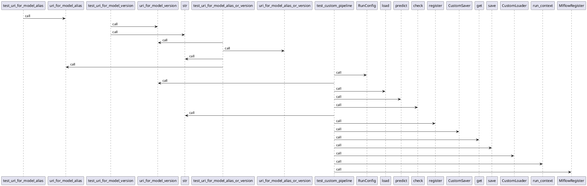
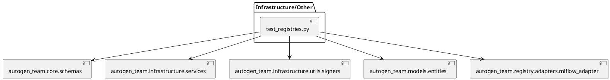
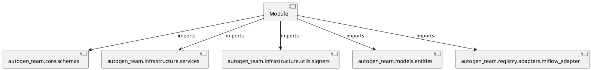
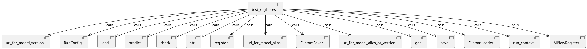

# Module Specification: test_registries

* **Source Reference:** `tests/registry/adapters/test_registries.py`

## 1. Architectural Role & Responsibilities
**Purpose:**
Provides functionality related to test registries.

**Architecture Layer:**
- Infrastructure/Other

**Responsibilities:**
- Manages operations and logic for test registries.

**Main Workflow:**
- Executes the primary flow defined by test registries functions and classes.

## 2. Dependencies
**Imports:**
- `autogen_team.core.schemas`
- `autogen_team.infrastructure.services`
- `autogen_team.infrastructure.utils.signers`
- `autogen_team.models.entities`
- `autogen_team.registry.adapters.mlflow_adapter`

**Exported Classes:**
- None

**Exported Functions:**
- `test_uri_for_model_alias`
- `test_uri_for_model_version`
- `test_uri_for_model_alias_or_version`
- `test_custom_pipeline`

**Exported Interfaces:**
- Not explicitly defined.

**Public API:**
- Not explicitly defined.

## 3. Architecture & Execution
### Internal Architecture
Not explicitly defined.

### Execution Flow
Not explicitly defined.

### Sequence Explanation
Not explicitly defined.

### Examples
Not explicitly defined.

## 4. UML 2.0 Diagrams
### Class Diagram

```plantuml
@startuml
    ' No classes found in module
@enduml
```

### Sequence Diagram

```plantuml
@startuml
    test_uri_for_model_alias -> uri_for_model_alias : call
    test_uri_for_model_version -> uri_for_model_version : call
    test_uri_for_model_version -> str : call
    test_uri_for_model_alias_or_version -> uri_for_model_version : call
    test_uri_for_model_alias_or_version -> uri_for_model_alias_or_version : call
    test_uri_for_model_alias_or_version -> str : call
    test_uri_for_model_alias_or_version -> uri_for_model_alias : call
    test_custom_pipeline -> RunConfig : call
    test_custom_pipeline -> uri_for_model_version : call
    test_custom_pipeline -> load : call
    test_custom_pipeline -> predict : call
    test_custom_pipeline -> check : call
    test_custom_pipeline -> str : call
    test_custom_pipeline -> register : call
    test_custom_pipeline -> CustomSaver : call
    test_custom_pipeline -> get : call
    test_custom_pipeline -> save : call
    test_custom_pipeline -> CustomLoader : call
    test_custom_pipeline -> run_context : call
    test_custom_pipeline -> MlflowRegister : call
@enduml
```

### Component Diagram

```plantuml
@startuml
    package "Infrastructure/Other" {
        [test_registries.py]
    }
    [test_registries.py] --> [autogen_team.core.schemas]
    [test_registries.py] --> [autogen_team.infrastructure.services]
    [test_registries.py] --> [autogen_team.infrastructure.utils.signers]
    [test_registries.py] --> [autogen_team.models.entities]
    [test_registries.py] --> [autogen_team.registry.adapters.mlflow_adapter]
@enduml
```

### Dependency Graph

```plantuml
@startuml
    [Module] --> [autogen_team.core.schemas] : imports
    [Module] --> [autogen_team.infrastructure.services] : imports
    [Module] --> [autogen_team.infrastructure.utils.signers] : imports
    [Module] --> [autogen_team.models.entities] : imports
    [Module] --> [autogen_team.registry.adapters.mlflow_adapter] : imports
@enduml
```

## 5. Class & Method Specifications
## 6. Module Functions
### `test_uri_for_model_alias()`
Executes the test uri for model alias operation.

**Inputs:**
- None

**Output:**
- return type: `None`
- semantic meaning: Returns the result of test uri for model alias.
- possible null values: Yes, if None allows it.
- exceptions: Standard execution exceptions.

**Side Effects:**
- Database updates: Not explicitly defined.
- File operations: Not explicitly defined.
- Network calls: Not explicitly defined.
- Cache: Not explicitly defined.
- State changes: Not explicitly defined.

### `test_uri_for_model_version()`
Executes the test uri for model version operation.

**Inputs:**
- None

**Output:**
- return type: `None`
- semantic meaning: Returns the result of test uri for model version.
- possible null values: Yes, if None allows it.
- exceptions: Standard execution exceptions.

**Side Effects:**
- Database updates: Not explicitly defined.
- File operations: Not explicitly defined.
- Network calls: Not explicitly defined.
- Cache: Not explicitly defined.
- State changes: Not explicitly defined.

### `test_uri_for_model_alias_or_version()`
Executes the test uri for model alias or version operation.

**Inputs:**
- None

**Output:**
- return type: `None`
- semantic meaning: Returns the result of test uri for model alias or version.
- possible null values: Yes, if None allows it.
- exceptions: Standard execution exceptions.

**Side Effects:**
- Database updates: Not explicitly defined.
- File operations: Not explicitly defined.
- Network calls: Not explicitly defined.
- Cache: Not explicitly defined.
- State changes: Not explicitly defined.

### `test_custom_pipeline(model: models.Model, inputs: schemas.Inputs, signature: signers.Signature, mlflow_service: services.MlflowService)`
Executes the test custom pipeline operation.

**Inputs:**
- `model`
  - type: models.Model
  - meaning: Represents the model parameter.
  - valid values: Any valid models.Model.
  - optional?: False
  - default value: None
- `inputs`
  - type: schemas.Inputs
  - meaning: Represents the inputs parameter.
  - valid values: Any valid schemas.Inputs.
  - optional?: False
  - default value: None
- `signature`
  - type: signers.Signature
  - meaning: Represents the signature parameter.
  - valid values: Any valid signers.Signature.
  - optional?: False
  - default value: None
- `mlflow_service`
  - type: services.MlflowService
  - meaning: Represents the mlflow service parameter.
  - valid values: Any valid services.MlflowService.
  - optional?: False
  - default value: None

**Output:**
- return type: `None`
- semantic meaning: Returns the result of test custom pipeline.
- possible null values: Yes, if None allows it.
- exceptions: Standard execution exceptions.

**Side Effects:**
- Database updates: Not explicitly defined.
- File operations: Not explicitly defined.
- Network calls: Not explicitly defined.
- Cache: Not explicitly defined.
- State changes: Not explicitly defined.

## 7. Call Graph

```plantuml
@startuml
[test_registries] --> [uri_for_model_version] : calls
[test_registries] --> [RunConfig] : calls
[test_registries] --> [load] : calls
[test_registries] --> [predict] : calls
[test_registries] --> [check] : calls
[test_registries] --> [str] : calls
[test_registries] --> [register] : calls
[test_registries] --> [uri_for_model_alias] : calls
[test_registries] --> [CustomSaver] : calls
[test_registries] --> [uri_for_model_alias_or_version] : calls
[test_registries] --> [get] : calls
[test_registries] --> [save] : calls
[test_registries] --> [CustomLoader] : calls
[test_registries] --> [run_context] : calls
[test_registries] --> [MlflowRegister] : calls
@enduml
```

## 8. Cross References
- **Parent module:** None
- **Child modules:** None
- **Dependencies:** `autogen_team.models.entities`, `autogen_team.core.schemas`, `autogen_team.infrastructure.services`, `autogen_team.infrastructure.utils.signers`, `autogen_team.registry.adapters.mlflow_adapter`
- **Used by:** None
- **Calls:** uri_for_model_version, RunConfig, load, predict, check, str, register, uri_for_model_alias, CustomSaver, uri_for_model_alias_or_version, get, save, CustomLoader, run_context, MlflowRegister
- **Called from:** None
- **Related classes:** [Classes](../../../../classes/index.md)
- **Related interfaces:** Not explicitly defined.
- **Related diagrams:** [Diagrams](../../../../diagrams/index.md)
