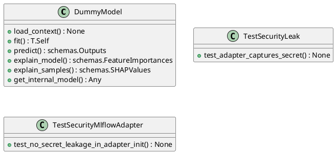
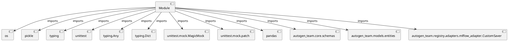

# Module Specification: test_security_mlflow_adapter

* **Source Reference:** `tests/registry/adapters/test_security_mlflow_adapter.py`

## 1. Architectural Role & Responsibilities
**Purpose:**
Provides functionality related to test security mlflow adapter.

**Architecture Layer:**
- Infrastructure/Other

**Responsibilities:**
- Not explicitly defined.

**Main Workflow:**
- Not explicitly defined.

## 2. Dependencies
**Imports:**
- `os`
- `pickle`
- `typing`
- `unittest`
- `typing.Any`
- `typing.Dict`
- `unittest.mock.MagicMock`
- `unittest.mock.patch`
- `pandas`
- `autogen_team.core.schemas`
- `autogen_team.models.entities`
- `autogen_team.registry.adapters.mlflow_adapter.CustomSaver`

**Exported Classes:**
- `DummyModel`
- `TestSecurityLeak`
- `TestSecurityMlflowAdapter`

**Exported Functions:**
- `test_mlflow_adapter_no_secret_leak`

## 3. Architecture & Execution
### Internal Architecture
Not explicitly defined.

### Execution Flow
Not explicitly defined.

### Sequence Explanation
Not explicitly defined.

## 4. UML 2.0 Diagrams
### Class Diagram


### Dependency Graph


## 5. Class & Method Specifications
### `DummyModel` ([`tests/registry/adapters/test_security_mlflow_adapter.py`](/tests/registry/adapters/test_security_mlflow_adapter.py))
#### Overview
A dummy model for testing.

#### Attributes
- None found.

#### Methods
##### `load_context(self, model_config: Dict[str, Any]) -> None` (Public)
**Description:** Load the model context.

**Inputs:**
- `model_config`: Dict[str, Any]

**Output:**
- Return Type: `None`
- Semantic Meaning: Not explicitly defined.

**Side Effects:**
- Not explicitly defined.

**Complexity:**
- Time Complexity: Not explicitly defined.
- Space Complexity: Not explicitly defined.

**Example:**
```python
result = DummyModel.load_context(...)
```

##### `fit(self, inputs: schemas.Inputs, targets: schemas.Targets) -> T.Self` (Public)
**Description:** Fit the model.

**Inputs:**
- `inputs`: schemas.Inputs
- `targets`: schemas.Targets

**Output:**
- Return Type: `T.Self`
- Semantic Meaning: Not explicitly defined.

**Side Effects:**
- Not explicitly defined.

**Complexity:**
- Time Complexity: Not explicitly defined.
- Space Complexity: Not explicitly defined.

**Example:**
```python
result = DummyModel.fit(..., ...)
```

##### `predict(self, inputs: schemas.Inputs) -> schemas.Outputs` (Public)
**Description:** Predict using the model.

**Inputs:**
- `inputs`: schemas.Inputs

**Output:**
- Return Type: `schemas.Outputs`
- Semantic Meaning: Not explicitly defined.

**Side Effects:**
- Not explicitly defined.

**Complexity:**
- Time Complexity: Not explicitly defined.
- Space Complexity: Not explicitly defined.

**Example:**
```python
result = DummyModel.predict(...)
```

##### `explain_model(self) -> schemas.FeatureImportances` (Public)
**Description:** Explain the model.

**Inputs:**
- None

**Output:**
- Return Type: `schemas.FeatureImportances`
- Semantic Meaning: Not explicitly defined.

**Side Effects:**
- Not explicitly defined.

**Complexity:**
- Time Complexity: Not explicitly defined.
- Space Complexity: Not explicitly defined.

**Example:**
```python
result = DummyModel.explain_model()
```

##### `explain_samples(self, inputs: schemas.Inputs) -> schemas.SHAPValues` (Public)
**Description:** Explain samples.

**Inputs:**
- `inputs`: schemas.Inputs

**Output:**
- Return Type: `schemas.SHAPValues`
- Semantic Meaning: Not explicitly defined.

**Side Effects:**
- Not explicitly defined.

**Complexity:**
- Time Complexity: Not explicitly defined.
- Space Complexity: Not explicitly defined.

**Example:**
```python
result = DummyModel.explain_samples(...)
```

##### `get_internal_model(self) -> Any` (Public)
**Description:** Get internal model.

**Inputs:**
- None

**Output:**
- Return Type: `Any`
- Semantic Meaning: Not explicitly defined.

**Side Effects:**
- Not explicitly defined.

**Complexity:**
- Time Complexity: Not explicitly defined.
- Space Complexity: Not explicitly defined.

**Example:**
```python
result = DummyModel.get_internal_model()
```

### `TestSecurityLeak` ([`tests/registry/adapters/test_security_mlflow_adapter.py`](/tests/registry/adapters/test_security_mlflow_adapter.py))
#### Overview
Provides state and behavior management for TestSecurityLeak.

#### Attributes
- None found.

#### Methods
##### `test_adapter_captures_secret(self) -> None` (Public)
**Description:** No description provided.

**Inputs:**
- None

**Output:**
- Return Type: `None`
- Semantic Meaning: Not explicitly defined.

**Side Effects:**
- Not explicitly defined.

**Complexity:**
- Time Complexity: Not explicitly defined.
- Space Complexity: Not explicitly defined.

**Example:**
```python
result = TestSecurityLeak.test_adapter_captures_secret()
```

### `TestSecurityMlflowAdapter` ([`tests/registry/adapters/test_security_mlflow_adapter.py`](/tests/registry/adapters/test_security_mlflow_adapter.py))
#### Overview
Provides state and behavior management for TestSecurityMlflowAdapter.

#### Attributes
- None found.

#### Methods
##### `test_no_secret_leakage_in_adapter_init(self) -> None` (Public)
**Description:** Test that CustomSaver.Adapter does not capture environment variables
(secrets) in its __init__ method, which would be pickled into the model artifact.

**Inputs:**
- None

**Output:**
- Return Type: `None`
- Semantic Meaning: Not explicitly defined.

**Side Effects:**
- Not explicitly defined.

**Complexity:**
- Time Complexity: Not explicitly defined.
- Space Complexity: Not explicitly defined.

**Example:**
```python
result = TestSecurityMlflowAdapter.test_no_secret_leakage_in_adapter_init()
```

## 6. Module Functions
### `test_mlflow_adapter_no_secret_leak()`
Test that MLflow adapter does not leak secrets.

**Inputs:**
- None

**Output:**
- Return Type: `None`
