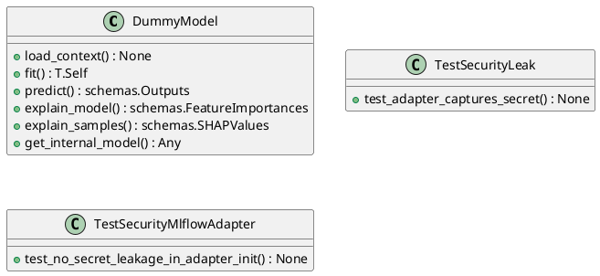
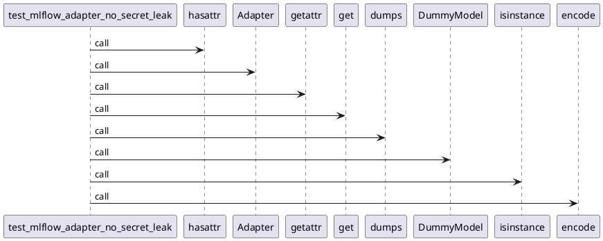
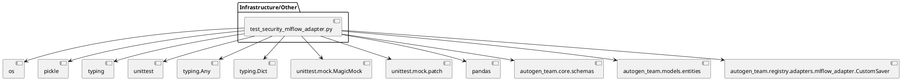
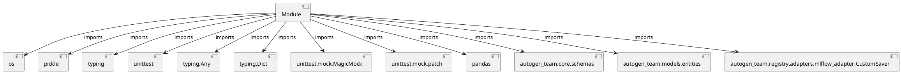

# Module Specification: test_security_mlflow_adapter

* **Source Reference:** `tests/registry/adapters/test_security_mlflow_adapter.py`

## 1. Architectural Role & Responsibilities
**Purpose:**
Provides functionality related to test security mlflow adapter.

**Architecture Layer:**
- Infrastructure/Other

**Responsibilities:**
- Manages operations and logic for test security mlflow adapter.

**Main Workflow:**
- Executes the primary flow defined by test security mlflow adapter functions and classes.

## 2. Dependencies
**Imports:**
- `os`
- `pickle`
- `typing`
- `unittest`
- `typing.Any`
- `typing.Dict`
- `unittest.mock.MagicMock`
- `unittest.mock.patch`
- `pandas`
- `autogen_team.core.schemas`
- `autogen_team.models.entities`
- `autogen_team.registry.adapters.mlflow_adapter.CustomSaver`

**Exported Classes:**
- `DummyModel`
- `TestSecurityLeak`
- `TestSecurityMlflowAdapter`

**Exported Functions:**
- `test_mlflow_adapter_no_secret_leak`

**Exported Interfaces:**
- Not explicitly defined.

**Public API:**
- Not explicitly defined.

## 3. Architecture & Execution
### Internal Architecture
Not explicitly defined.

### Execution Flow
Not explicitly defined.

### Sequence Explanation
Not explicitly defined.

### Examples
Not explicitly defined.

## 4. UML 2.0 Diagrams
### Class Diagram

```plantuml
@startuml
    class DummyModel {
        +load_context() : None
        +fit() : T.Self
        +predict() : schemas.Outputs
        +explain_model() : schemas.FeatureImportances
        +explain_samples() : schemas.SHAPValues
        +get_internal_model() : Any
    }
    class TestSecurityLeak {
        +test_adapter_captures_secret() : None
    }
    class TestSecurityMlflowAdapter {
        +test_no_secret_leakage_in_adapter_init() : None
    }
@enduml
```

### Sequence Diagram

```plantuml
@startuml
    test_mlflow_adapter_no_secret_leak -> hasattr : call
    test_mlflow_adapter_no_secret_leak -> Adapter : call
    test_mlflow_adapter_no_secret_leak -> getattr : call
    test_mlflow_adapter_no_secret_leak -> get : call
    test_mlflow_adapter_no_secret_leak -> dumps : call
    test_mlflow_adapter_no_secret_leak -> DummyModel : call
    test_mlflow_adapter_no_secret_leak -> isinstance : call
    test_mlflow_adapter_no_secret_leak -> encode : call
@enduml
```

### Component Diagram

```plantuml
@startuml
    package "Infrastructure/Other" {
        [test_security_mlflow_adapter.py]
    }
    [test_security_mlflow_adapter.py] --> [os]
    [test_security_mlflow_adapter.py] --> [pickle]
    [test_security_mlflow_adapter.py] --> [typing]
    [test_security_mlflow_adapter.py] --> [unittest]
    [test_security_mlflow_adapter.py] --> [typing.Any]
    [test_security_mlflow_adapter.py] --> [typing.Dict]
    [test_security_mlflow_adapter.py] --> [unittest.mock.MagicMock]
    [test_security_mlflow_adapter.py] --> [unittest.mock.patch]
    [test_security_mlflow_adapter.py] --> [pandas]
    [test_security_mlflow_adapter.py] --> [autogen_team.core.schemas]
    [test_security_mlflow_adapter.py] --> [autogen_team.models.entities]
    [test_security_mlflow_adapter.py] --> [autogen_team.registry.adapters.mlflow_adapter.CustomSaver]
@enduml
```

### Dependency Graph

```plantuml
@startuml
    [Module] --> [os] : imports
    [Module] --> [pickle] : imports
    [Module] --> [typing] : imports
    [Module] --> [unittest] : imports
    [Module] --> [typing.Any] : imports
    [Module] --> [typing.Dict] : imports
    [Module] --> [unittest.mock.MagicMock] : imports
    [Module] --> [unittest.mock.patch] : imports
    [Module] --> [pandas] : imports
    [Module] --> [autogen_team.core.schemas] : imports
    [Module] --> [autogen_team.models.entities] : imports
    [Module] --> [autogen_team.registry.adapters.mlflow_adapter.CustomSaver] : imports
@enduml
```

## 5. Class & Method Specifications
### `DummyModel` ([`tests/registry/adapters/test_security_mlflow_adapter.py`](/tests/registry/adapters/test_security_mlflow_adapter.py))
#### Overview
A dummy model for testing.

#### Attributes
- None found.

#### Methods
##### `load_context(self, model_config: Dict[str, Any]) -> None` (Public)
**Description:** Load the model context.

**Inputs:**
- `model_config`
  - type: Dict[str, Any]
  - meaning: Represents the model config parameter.
  - valid values: Any valid Dict[str, Any].
  - optional?: False
  - default value: None

**Output:**
- return type: `None`
- semantic meaning: Returns the result of load context.
- possible null values: Yes, if None allows it.
- exceptions: Standard execution exceptions.

**Side Effects:**
- Database updates: Not explicitly defined.
- File operations: Not explicitly defined.
- Network calls: Not explicitly defined.
- Cache: Not explicitly defined.
- State changes: Not explicitly defined.

**Complexity:**
- Time Complexity: Not explicitly defined.
- Space Complexity: Not explicitly defined.

**Example:**
```python
result = DummyModel.load_context(...)
```

##### `fit(self, inputs: schemas.Inputs, targets: schemas.Targets) -> T.Self` (Public)
**Description:** Fit the model.

**Inputs:**
- `inputs`
  - type: schemas.Inputs
  - meaning: Represents the inputs parameter.
  - valid values: Any valid schemas.Inputs.
  - optional?: False
  - default value: None
- `targets`
  - type: schemas.Targets
  - meaning: Represents the targets parameter.
  - valid values: Any valid schemas.Targets.
  - optional?: False
  - default value: None

**Output:**
- return type: `T.Self`
- semantic meaning: Returns the result of fit.
- possible null values: Yes, if T.Self allows it.
- exceptions: Standard execution exceptions.

**Side Effects:**
- Database updates: Not explicitly defined.
- File operations: Not explicitly defined.
- Network calls: Not explicitly defined.
- Cache: Not explicitly defined.
- State changes: Not explicitly defined.

**Complexity:**
- Time Complexity: Not explicitly defined.
- Space Complexity: Not explicitly defined.

**Example:**
```python
result = DummyModel.fit(..., ...)
```

##### `predict(self, inputs: schemas.Inputs) -> schemas.Outputs` (Public)
**Description:** Predict using the model.

**Inputs:**
- `inputs`
  - type: schemas.Inputs
  - meaning: Represents the inputs parameter.
  - valid values: Any valid schemas.Inputs.
  - optional?: False
  - default value: None

**Output:**
- return type: `schemas.Outputs`
- semantic meaning: Returns the result of predict.
- possible null values: Yes, if schemas.Outputs allows it.
- exceptions: Standard execution exceptions.

**Side Effects:**
- Database updates: Not explicitly defined.
- File operations: Not explicitly defined.
- Network calls: Not explicitly defined.
- Cache: Not explicitly defined.
- State changes: Not explicitly defined.

**Complexity:**
- Time Complexity: Not explicitly defined.
- Space Complexity: Not explicitly defined.

**Example:**
```python
result = DummyModel.predict(...)
```

##### `explain_model(self) -> schemas.FeatureImportances` (Public)
**Description:** Explain the model.

**Inputs:**
- None

**Output:**
- return type: `schemas.FeatureImportances`
- semantic meaning: Returns the result of explain model.
- possible null values: Yes, if schemas.FeatureImportances allows it.
- exceptions: Standard execution exceptions.

**Side Effects:**
- Database updates: Not explicitly defined.
- File operations: Not explicitly defined.
- Network calls: Not explicitly defined.
- Cache: Not explicitly defined.
- State changes: Not explicitly defined.

**Complexity:**
- Time Complexity: Not explicitly defined.
- Space Complexity: Not explicitly defined.

**Example:**
```python
result = DummyModel.explain_model()
```

##### `explain_samples(self, inputs: schemas.Inputs) -> schemas.SHAPValues` (Public)
**Description:** Explain samples.

**Inputs:**
- `inputs`
  - type: schemas.Inputs
  - meaning: Represents the inputs parameter.
  - valid values: Any valid schemas.Inputs.
  - optional?: False
  - default value: None

**Output:**
- return type: `schemas.SHAPValues`
- semantic meaning: Returns the result of explain samples.
- possible null values: Yes, if schemas.SHAPValues allows it.
- exceptions: Standard execution exceptions.

**Side Effects:**
- Database updates: Not explicitly defined.
- File operations: Not explicitly defined.
- Network calls: Not explicitly defined.
- Cache: Not explicitly defined.
- State changes: Not explicitly defined.

**Complexity:**
- Time Complexity: Not explicitly defined.
- Space Complexity: Not explicitly defined.

**Example:**
```python
result = DummyModel.explain_samples(...)
```

##### `get_internal_model(self) -> Any` (Public)
**Description:** Get internal model.

**Inputs:**
- None

**Output:**
- return type: `Any`
- semantic meaning: Returns the result of get internal model.
- possible null values: Yes, if Any allows it.
- exceptions: Standard execution exceptions.

**Side Effects:**
- Database updates: Not explicitly defined.
- File operations: Not explicitly defined.
- Network calls: Not explicitly defined.
- Cache: Not explicitly defined.
- State changes: Not explicitly defined.

**Complexity:**
- Time Complexity: Not explicitly defined.
- Space Complexity: Not explicitly defined.

**Example:**
```python
result = DummyModel.get_internal_model()
```

### `TestSecurityLeak` ([`tests/registry/adapters/test_security_mlflow_adapter.py`](/tests/registry/adapters/test_security_mlflow_adapter.py))
#### Overview
Provides state and behavior management for TestSecurityLeak.

#### Attributes
- None found.

#### Methods
##### `test_adapter_captures_secret(self) -> None` (Public)
**Description:** Executes the test adapter captures secret operation.

**Inputs:**
- None

**Output:**
- return type: `None`
- semantic meaning: Returns the result of test adapter captures secret.
- possible null values: Yes, if None allows it.
- exceptions: Standard execution exceptions.

**Side Effects:**
- Database updates: Not explicitly defined.
- File operations: Not explicitly defined.
- Network calls: Not explicitly defined.
- Cache: Not explicitly defined.
- State changes: Not explicitly defined.

**Complexity:**
- Time Complexity: Not explicitly defined.
- Space Complexity: Not explicitly defined.

**Example:**
```python
result = TestSecurityLeak.test_adapter_captures_secret()
```

### `TestSecurityMlflowAdapter` ([`tests/registry/adapters/test_security_mlflow_adapter.py`](/tests/registry/adapters/test_security_mlflow_adapter.py))
#### Overview
Provides state and behavior management for TestSecurityMlflowAdapter.

#### Attributes
- None found.

#### Methods
##### `test_no_secret_leakage_in_adapter_init(self) -> None` (Public)
**Description:** Test that CustomSaver.Adapter does not capture environment variables
(secrets) in its __init__ method, which would be pickled into the model artifact.

**Inputs:**
- None

**Output:**
- return type: `None`
- semantic meaning: Returns the result of test no secret leakage in adapter init.
- possible null values: Yes, if None allows it.
- exceptions: Standard execution exceptions.

**Side Effects:**
- Database updates: Not explicitly defined.
- File operations: Not explicitly defined.
- Network calls: Not explicitly defined.
- Cache: Not explicitly defined.
- State changes: Not explicitly defined.

**Complexity:**
- Time Complexity: Not explicitly defined.
- Space Complexity: Not explicitly defined.

**Example:**
```python
result = TestSecurityMlflowAdapter.test_no_secret_leakage_in_adapter_init()
```

## 6. Module Functions
### `test_mlflow_adapter_no_secret_leak()`
Test that MLflow adapter does not leak secrets.

**Inputs:**
- None

**Output:**
- return type: `None`
- semantic meaning: Returns the result of test mlflow adapter no secret leak.
- possible null values: Yes, if None allows it.
- exceptions: Standard execution exceptions.

**Side Effects:**
- Database updates: Not explicitly defined.
- File operations: Not explicitly defined.
- Network calls: Not explicitly defined.
- Cache: Not explicitly defined.
- State changes: Not explicitly defined.

## 7. Call Graph

```plantuml
@startuml
[test_security_mlflow_adapter] --> [assertNotIn] : calls
[test_security_mlflow_adapter] --> [MagicMock] : calls
[test_security_mlflow_adapter] --> [encode] : calls
[test_security_mlflow_adapter] --> [main] : calls
[test_security_mlflow_adapter] --> [assertFalse] : calls
[test_security_mlflow_adapter] --> [Outputs] : calls
[test_security_mlflow_adapter] --> [Adapter] : calls
[test_security_mlflow_adapter] --> [getattr] : calls
[test_security_mlflow_adapter] --> [fail] : calls
[test_security_mlflow_adapter] --> [FeatureImportances] : calls
[test_security_mlflow_adapter] --> [isinstance] : calls
[test_security_mlflow_adapter] --> [assertNotEqual] : calls
[test_security_mlflow_adapter] --> [hasattr] : calls
[test_security_mlflow_adapter] --> [items] : calls
[test_security_mlflow_adapter] --> [SHAPValues] : calls
[test_security_mlflow_adapter] --> [get] : calls
[test_security_mlflow_adapter] --> [dumps] : calls
[test_security_mlflow_adapter] --> [DummyModel] : calls
[test_security_mlflow_adapter] --> [dict] : calls
[test_security_mlflow_adapter] --> [DataFrame] : calls
@enduml
```

## 8. Cross References
- **Parent module:** None
- **Child modules:** None
- **Dependencies:** `os`, `pandas`, `unittest`, `typing`, `unittest.mock.patch`, `typing.Dict`, `autogen_team.models.entities`, `autogen_team.core.schemas`, `autogen_team.registry.adapters.mlflow_adapter.CustomSaver`, `typing.Any`, `pickle`, `unittest.mock.MagicMock`
- **Used by:** test_mlflow_adapter_security.md
- **Calls:** assertNotIn, MagicMock, encode, main, assertFalse, Outputs, Adapter, getattr, fail, FeatureImportances, isinstance, assertNotEqual, hasattr, items, SHAPValues, get, dumps, DummyModel, dict, DataFrame
- **Called from:** None
- **Related classes:** [Classes](../../../../classes/index.md)
- **Related interfaces:** Not explicitly defined.
- **Related diagrams:** [Diagrams](../../../../diagrams/index.md)
