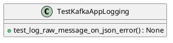
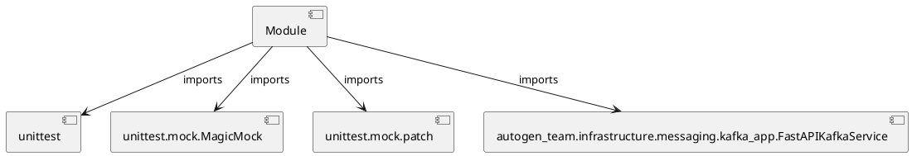

# Module Specification: repro_kafka_log

* **Source Reference:** `tests/repro_kafka_log.py`

## 1. Architectural Role & Responsibilities
**Purpose:**
Provides functionality related to repro kafka log.

**Architecture Layer:**
- Infrastructure/Other

**Responsibilities:**
- Not explicitly defined.

**Main Workflow:**
- Not explicitly defined.

## 2. Dependencies
**Imports:**
- `unittest`
- `unittest.mock.MagicMock`
- `unittest.mock.patch`
- `autogen_team.infrastructure.messaging.kafka_app.FastAPIKafkaService`

**Exported Classes:**
- `TestKafkaAppLogging`

**Exported Functions:**
- None

## 3. Architecture & Execution
### Internal Architecture
Not explicitly defined.

### Execution Flow
Not explicitly defined.

### Sequence Explanation
Not explicitly defined.

## 4. UML 2.0 Diagrams
### Class Diagram


### Dependency Graph


## 5. Class & Method Specifications
### `TestKafkaAppLogging` ([`tests/repro_kafka_log.py`](/tests/repro_kafka_log.py))
#### Overview
Provides state and behavior management for TestKafkaAppLogging.

#### Attributes
- None found.

#### Methods
##### `test_log_raw_message_on_json_error(self) -> None` (Public)
**Description:** No description provided.

**Inputs:**
- None

**Output:**
- Return Type: `None`
- Semantic Meaning: Not explicitly defined.

**Side Effects:**
- Not explicitly defined.

**Complexity:**
- Time Complexity: Not explicitly defined.
- Space Complexity: Not explicitly defined.

**Example:**
```python
result = TestKafkaAppLogging.test_log_raw_message_on_json_error()
```

## 6. Module Functions