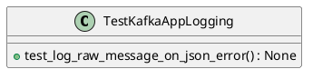
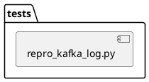
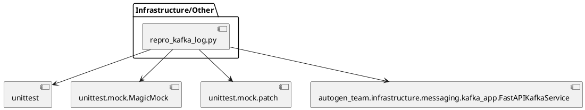
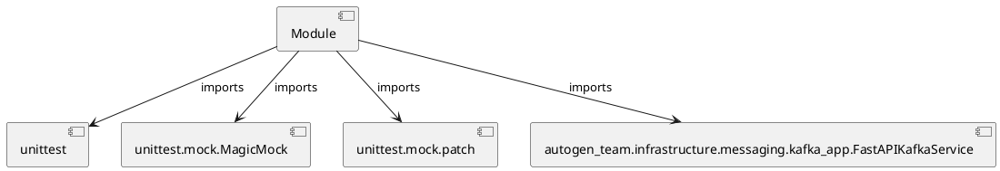
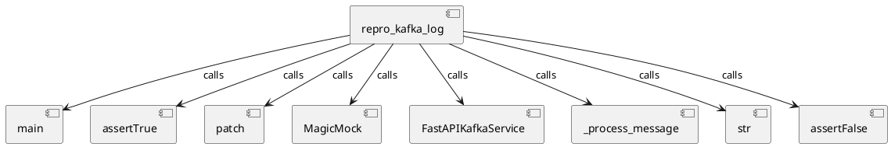

# Module Specification: repro_kafka_log

* **Source Reference:** `tests/repro_kafka_log.py`

## 1. Architectural Role & Responsibilities
**Purpose:**
Provides functionality related to repro kafka log.

**Architecture Layer:**
- Infrastructure/Other

**Responsibilities:**
- Not explicitly defined.

**Main Workflow:**
- Not explicitly defined.

## 2. Dependencies
**Imports:**
- `unittest`
- `unittest.mock.MagicMock`
- `unittest.mock.patch`
- `autogen_team.infrastructure.messaging.kafka_app.FastAPIKafkaService`

**Exported Classes:**
- `TestKafkaAppLogging`

**Exported Functions:**
- None

**Exported Interfaces:**
- Not explicitly defined.

**Public API:**
- Not explicitly defined.

## 3. Architecture & Execution
### Internal Architecture
Not explicitly defined.

### Execution Flow
Not explicitly defined.

### Sequence Explanation
Not explicitly defined.

### Examples
Not explicitly defined.

## 4. UML 2.0 Diagrams
### Class Diagram

```plantuml
@startuml
    class TestKafkaAppLogging {
        +test_log_raw_message_on_json_error() : None
    }
@enduml
```

### Package Diagram

```plantuml
@startuml
    package "tests" {
        [repro_kafka_log.py]
    }
@enduml
```

### Sequence Diagram

```plantuml
@startuml
    ' No functions for sequence
@enduml
```

### Component Diagram

```plantuml
@startuml
    package "Infrastructure/Other" {
        [repro_kafka_log.py]
    }
    [repro_kafka_log.py] --> [unittest]
    [repro_kafka_log.py] --> [unittest.mock.MagicMock]
    [repro_kafka_log.py] --> [unittest.mock.patch]
    [repro_kafka_log.py] --> [autogen_team.infrastructure.messaging.kafka_app.FastAPIKafkaService]
@enduml
```

### Dependency Graph

```plantuml
@startuml
    [Module] --> [unittest] : imports
    [Module] --> [unittest.mock.MagicMock] : imports
    [Module] --> [unittest.mock.patch] : imports
    [Module] --> [autogen_team.infrastructure.messaging.kafka_app.FastAPIKafkaService] : imports
@enduml
```

## 5. Class & Method Specifications
### `TestKafkaAppLogging` ([`tests/repro_kafka_log.py`](/tests/repro_kafka_log.py))
#### Overview
Provides state and behavior management for TestKafkaAppLogging.

#### Attributes
- None found.

#### Methods
##### `test_log_raw_message_on_json_error(self) -> None` (Public)
**Description:** No description provided.

**Inputs:**
- None

**Output:**
- return type: `None`
- semantic meaning: Not explicitly defined.
- possible null values: Not explicitly defined.
- exceptions: Not explicitly defined.

**Side Effects:**
- Database updates: Not explicitly defined.
- File operations: Not explicitly defined.
- Network calls: Not explicitly defined.
- Cache: Not explicitly defined.
- State changes: Not explicitly defined.

**Complexity:**
- Time Complexity: Not explicitly defined.
- Space Complexity: Not explicitly defined.

**Example:**
```python
result = TestKafkaAppLogging.test_log_raw_message_on_json_error()
```

## 6. Module Functions
## 7. Call Graph

```plantuml
@startuml
[repro_kafka_log] --> [main] : calls
[repro_kafka_log] --> [assertTrue] : calls
[repro_kafka_log] --> [patch] : calls
[repro_kafka_log] --> [MagicMock] : calls
[repro_kafka_log] --> [FastAPIKafkaService] : calls
[repro_kafka_log] --> [_process_message] : calls
[repro_kafka_log] --> [str] : calls
[repro_kafka_log] --> [assertFalse] : calls
@enduml
```

## 8. Cross References
- **Dependencies:** [Dependencies](../../dependencies/index.md)
- **Used by:** None
- **Calls:** main, assertTrue, patch, MagicMock, FastAPIKafkaService, _process_message, str, assertFalse
- **Called from:** None
- **Related classes:** [Classes](../../classes/index.md)
- **Related diagrams:** [Diagrams](../../diagrams/index.md)
