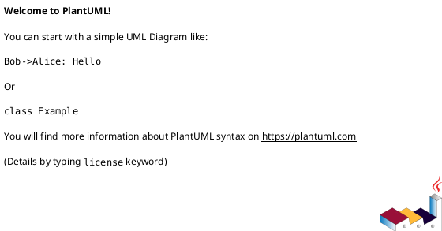
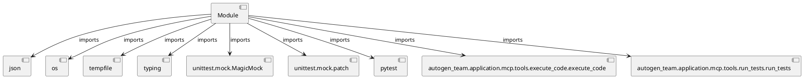

# Module Specification: test_mcp_path_traversal

* **Source Reference:** `tests/security/test_mcp_path_traversal.py`

## 1. Architectural Role & Responsibilities
**Purpose:**
Provides functionality related to test mcp path traversal.

**Architecture Layer:**
- Infrastructure/Other

**Responsibilities:**
- Not explicitly defined.

**Main Workflow:**
- Not explicitly defined.

## 2. Dependencies
**Imports:**
- `json`
- `os`
- `tempfile`
- `typing`
- `unittest.mock.MagicMock`
- `unittest.mock.patch`
- `pytest`
- `autogen_team.application.mcp.tools.execute_code.execute_code`
- `autogen_team.application.mcp.tools.run_tests.run_tests`

**Exported Classes:**
- None

**Exported Functions:**
- `test_execute_code_path_traversal`
- `test_run_tests_path_traversal`
- `test_execute_code_workspace_path_traversal`
- `test_run_tests_workspace_path_traversal`

## 3. Architecture & Execution
### Internal Architecture
Not explicitly defined.

### Execution Flow
Not explicitly defined.

### Sequence Explanation
Not explicitly defined.

## 4. UML 2.0 Diagrams
### Class Diagram

### Dependency Graph

## 5. Class & Method Specifications
## 6. Module Functions
### `test_execute_code_path_traversal()`
No description provided.

**Inputs:**
- None

**Output:**
- Return Type: `None`

### `test_run_tests_path_traversal()`
No description provided.

**Inputs:**
- None

**Output:**
- Return Type: `None`

### `test_execute_code_workspace_path_traversal()`
No description provided.

**Inputs:**
- None

**Output:**
- Return Type: `None`

### `test_run_tests_workspace_path_traversal()`
No description provided.

**Inputs:**
- None

**Output:**
- Return Type: `None`
