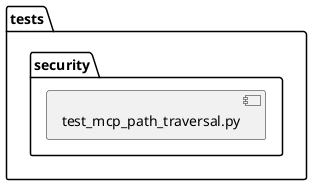
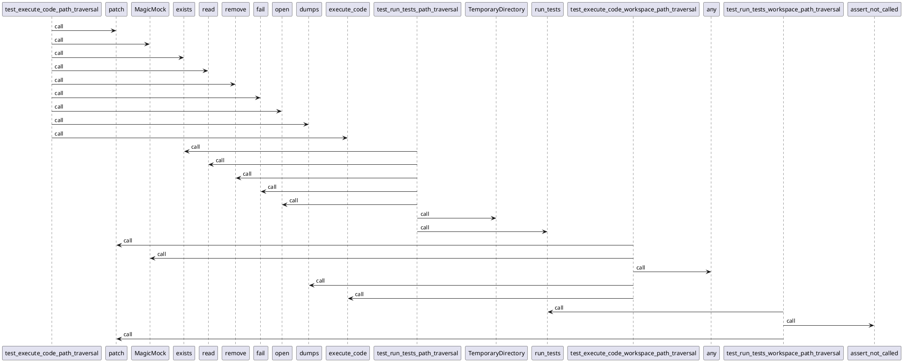
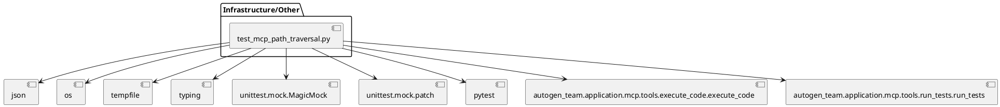
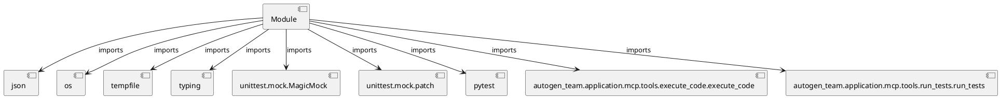
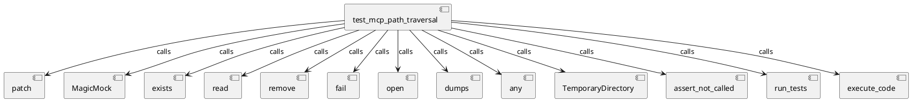

# Module Specification: test_mcp_path_traversal

* **Source Reference:** `tests/security/test_mcp_path_traversal.py`

## 1. Architectural Role & Responsibilities
**Purpose:**
Provides functionality related to test mcp path traversal.

**Architecture Layer:**
- Infrastructure/Other

**Responsibilities:**
- Not explicitly defined.

**Main Workflow:**
- Not explicitly defined.

## 2. Dependencies
**Imports:**
- `json`
- `os`
- `tempfile`
- `typing`
- `unittest.mock.MagicMock`
- `unittest.mock.patch`
- `pytest`
- `autogen_team.application.mcp.tools.execute_code.execute_code`
- `autogen_team.application.mcp.tools.run_tests.run_tests`

**Exported Classes:**
- None

**Exported Functions:**
- `test_execute_code_path_traversal`
- `test_run_tests_path_traversal`
- `test_execute_code_workspace_path_traversal`
- `test_run_tests_workspace_path_traversal`

**Exported Interfaces:**
- Not explicitly defined.

**Public API:**
- Not explicitly defined.

## 3. Architecture & Execution
### Internal Architecture
Not explicitly defined.

### Execution Flow
Not explicitly defined.

### Sequence Explanation
Not explicitly defined.

### Examples
Not explicitly defined.

## 4. UML 2.0 Diagrams
### Class Diagram

```plantuml
@startuml
    ' No classes found in module
@enduml
```

### Package Diagram

```plantuml
@startuml
    package "tests" {
        package "security" {
            [test_mcp_path_traversal.py]
        }
    }
@enduml
```

### Sequence Diagram

```plantuml
@startuml
    test_execute_code_path_traversal -> patch : call
    test_execute_code_path_traversal -> MagicMock : call
    test_execute_code_path_traversal -> exists : call
    test_execute_code_path_traversal -> read : call
    test_execute_code_path_traversal -> remove : call
    test_execute_code_path_traversal -> fail : call
    test_execute_code_path_traversal -> open : call
    test_execute_code_path_traversal -> dumps : call
    test_execute_code_path_traversal -> execute_code : call
    test_run_tests_path_traversal -> exists : call
    test_run_tests_path_traversal -> read : call
    test_run_tests_path_traversal -> remove : call
    test_run_tests_path_traversal -> fail : call
    test_run_tests_path_traversal -> open : call
    test_run_tests_path_traversal -> TemporaryDirectory : call
    test_run_tests_path_traversal -> run_tests : call
    test_execute_code_workspace_path_traversal -> patch : call
    test_execute_code_workspace_path_traversal -> MagicMock : call
    test_execute_code_workspace_path_traversal -> any : call
    test_execute_code_workspace_path_traversal -> dumps : call
    test_execute_code_workspace_path_traversal -> execute_code : call
    test_run_tests_workspace_path_traversal -> run_tests : call
    test_run_tests_workspace_path_traversal -> assert_not_called : call
    test_run_tests_workspace_path_traversal -> patch : call
@enduml
```

### Component Diagram

```plantuml
@startuml
    package "Infrastructure/Other" {
        [test_mcp_path_traversal.py]
    }
    [test_mcp_path_traversal.py] --> [json]
    [test_mcp_path_traversal.py] --> [os]
    [test_mcp_path_traversal.py] --> [tempfile]
    [test_mcp_path_traversal.py] --> [typing]
    [test_mcp_path_traversal.py] --> [unittest.mock.MagicMock]
    [test_mcp_path_traversal.py] --> [unittest.mock.patch]
    [test_mcp_path_traversal.py] --> [pytest]
    [test_mcp_path_traversal.py] --> [autogen_team.application.mcp.tools.execute_code.execute_code]
    [test_mcp_path_traversal.py] --> [autogen_team.application.mcp.tools.run_tests.run_tests]
@enduml
```

### Dependency Graph

```plantuml
@startuml
    [Module] --> [json] : imports
    [Module] --> [os] : imports
    [Module] --> [tempfile] : imports
    [Module] --> [typing] : imports
    [Module] --> [unittest.mock.MagicMock] : imports
    [Module] --> [unittest.mock.patch] : imports
    [Module] --> [pytest] : imports
    [Module] --> [autogen_team.application.mcp.tools.execute_code.execute_code] : imports
    [Module] --> [autogen_team.application.mcp.tools.run_tests.run_tests] : imports
@enduml
```

## 5. Class & Method Specifications
## 6. Module Functions
### `test_execute_code_path_traversal() -> None` (Public)
**Description:** No description provided.

**Inputs:**
- None

**Output:**
- return type: `None`
- semantic meaning: Not explicitly defined.
- possible null values: Not explicitly defined.
- exceptions: Not explicitly defined.

**Side Effects:**
- Database updates: Not explicitly defined.
- File operations: Not explicitly defined.
- Network calls: Not explicitly defined.
- Cache: Not explicitly defined.
- State changes: Not explicitly defined.

**Complexity:**
- Time Complexity: Not explicitly defined.
- Space Complexity: Not explicitly defined.

**Example:**
```python
result = test_execute_code_path_traversal()
```

### `test_run_tests_path_traversal() -> None` (Public)
**Description:** No description provided.

**Inputs:**
- None

**Output:**
- return type: `None`
- semantic meaning: Not explicitly defined.
- possible null values: Not explicitly defined.
- exceptions: Not explicitly defined.

**Side Effects:**
- Database updates: Not explicitly defined.
- File operations: Not explicitly defined.
- Network calls: Not explicitly defined.
- Cache: Not explicitly defined.
- State changes: Not explicitly defined.

**Complexity:**
- Time Complexity: Not explicitly defined.
- Space Complexity: Not explicitly defined.

**Example:**
```python
result = test_run_tests_path_traversal()
```

### `test_execute_code_workspace_path_traversal() -> None` (Public)
**Description:** No description provided.

**Inputs:**
- None

**Output:**
- return type: `None`
- semantic meaning: Not explicitly defined.
- possible null values: Not explicitly defined.
- exceptions: Not explicitly defined.

**Side Effects:**
- Database updates: Not explicitly defined.
- File operations: Not explicitly defined.
- Network calls: Not explicitly defined.
- Cache: Not explicitly defined.
- State changes: Not explicitly defined.

**Complexity:**
- Time Complexity: Not explicitly defined.
- Space Complexity: Not explicitly defined.

**Example:**
```python
result = test_execute_code_workspace_path_traversal()
```

### `test_run_tests_workspace_path_traversal() -> None` (Public)
**Description:** No description provided.

**Inputs:**
- None

**Output:**
- return type: `None`
- semantic meaning: Not explicitly defined.
- possible null values: Not explicitly defined.
- exceptions: Not explicitly defined.

**Side Effects:**
- Database updates: Not explicitly defined.
- File operations: Not explicitly defined.
- Network calls: Not explicitly defined.
- Cache: Not explicitly defined.
- State changes: Not explicitly defined.

**Complexity:**
- Time Complexity: Not explicitly defined.
- Space Complexity: Not explicitly defined.

**Example:**
```python
result = test_run_tests_workspace_path_traversal()
```

## 7. Call Graph

```plantuml
@startuml
[test_mcp_path_traversal] --> [patch] : calls
[test_mcp_path_traversal] --> [MagicMock] : calls
[test_mcp_path_traversal] --> [exists] : calls
[test_mcp_path_traversal] --> [read] : calls
[test_mcp_path_traversal] --> [remove] : calls
[test_mcp_path_traversal] --> [fail] : calls
[test_mcp_path_traversal] --> [open] : calls
[test_mcp_path_traversal] --> [dumps] : calls
[test_mcp_path_traversal] --> [any] : calls
[test_mcp_path_traversal] --> [TemporaryDirectory] : calls
[test_mcp_path_traversal] --> [assert_not_called] : calls
[test_mcp_path_traversal] --> [run_tests] : calls
[test_mcp_path_traversal] --> [execute_code] : calls
@enduml
```

## 8. Cross References
- **Dependencies:** [Dependencies](../../../dependencies/index.md)
- **Used by:** None
- **Calls:** patch, MagicMock, exists, read, remove, fail, open, dumps, any, TemporaryDirectory, assert_not_called, run_tests, execute_code
- **Called from:** None
- **Related classes:** [Classes](../../../classes/index.md)
- **Related diagrams:** [Diagrams](../../../diagrams/index.md)
