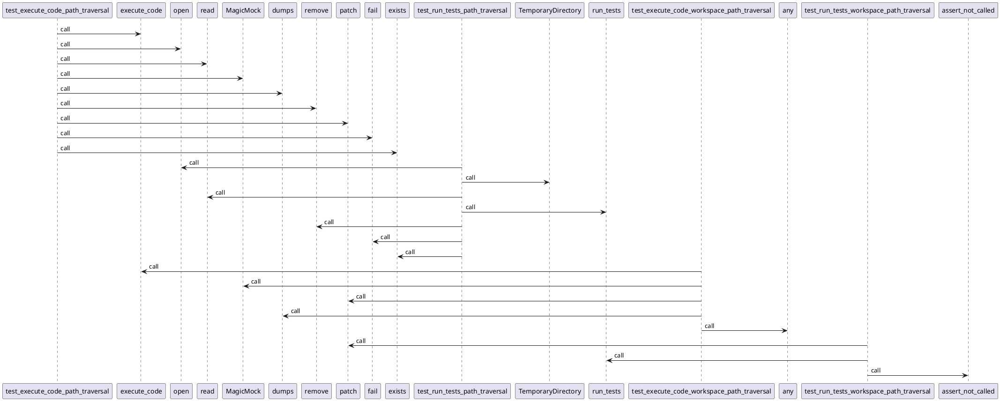
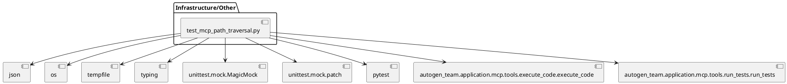
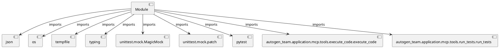
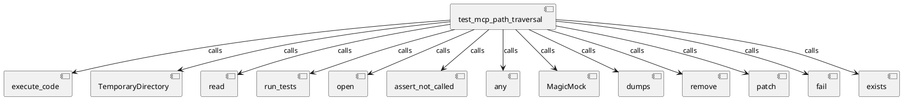

# Module Specification: test_mcp_path_traversal

* **Source Reference:** `tests/security/test_mcp_path_traversal.py`

## 1. Architectural Role & Responsibilities
**Purpose:**
Provides functionality related to test mcp path traversal.

**Architecture Layer:**
- Infrastructure/Other

**Responsibilities:**
- Manages operations and logic for test mcp path traversal.

**Main Workflow:**
- Executes the primary flow defined by test mcp path traversal functions and classes.

## 2. Dependencies
**Imports:**
- `json`
- `os`
- `tempfile`
- `typing`
- `unittest.mock.MagicMock`
- `unittest.mock.patch`
- `pytest`
- `autogen_team.application.mcp.tools.execute_code.execute_code`
- `autogen_team.application.mcp.tools.run_tests.run_tests`

**Exported Classes:**
- None

**Exported Functions:**
- `test_execute_code_path_traversal`
- `test_run_tests_path_traversal`
- `test_execute_code_workspace_path_traversal`
- `test_run_tests_workspace_path_traversal`

**Exported Interfaces:**
- Not explicitly defined.

**Public API:**
- Not explicitly defined.

## 3. Architecture & Execution
### Internal Architecture
Not explicitly defined.

### Execution Flow
Not explicitly defined.

### Sequence Explanation
Not explicitly defined.

### Examples
Not explicitly defined.

## 4. UML 2.0 Diagrams
### Class Diagram

```plantuml
@startuml
    ' No classes found in module
@enduml
```

### Sequence Diagram

```plantuml
@startuml
    test_execute_code_path_traversal -> execute_code : call
    test_execute_code_path_traversal -> open : call
    test_execute_code_path_traversal -> read : call
    test_execute_code_path_traversal -> MagicMock : call
    test_execute_code_path_traversal -> dumps : call
    test_execute_code_path_traversal -> remove : call
    test_execute_code_path_traversal -> patch : call
    test_execute_code_path_traversal -> fail : call
    test_execute_code_path_traversal -> exists : call
    test_run_tests_path_traversal -> open : call
    test_run_tests_path_traversal -> TemporaryDirectory : call
    test_run_tests_path_traversal -> read : call
    test_run_tests_path_traversal -> run_tests : call
    test_run_tests_path_traversal -> remove : call
    test_run_tests_path_traversal -> fail : call
    test_run_tests_path_traversal -> exists : call
    test_execute_code_workspace_path_traversal -> execute_code : call
    test_execute_code_workspace_path_traversal -> MagicMock : call
    test_execute_code_workspace_path_traversal -> patch : call
    test_execute_code_workspace_path_traversal -> dumps : call
    test_execute_code_workspace_path_traversal -> any : call
    test_run_tests_workspace_path_traversal -> patch : call
    test_run_tests_workspace_path_traversal -> run_tests : call
    test_run_tests_workspace_path_traversal -> assert_not_called : call
@enduml
```

### Component Diagram

```plantuml
@startuml
    package "Infrastructure/Other" {
        [test_mcp_path_traversal.py]
    }
    [test_mcp_path_traversal.py] --> [json]
    [test_mcp_path_traversal.py] --> [os]
    [test_mcp_path_traversal.py] --> [tempfile]
    [test_mcp_path_traversal.py] --> [typing]
    [test_mcp_path_traversal.py] --> [unittest.mock.MagicMock]
    [test_mcp_path_traversal.py] --> [unittest.mock.patch]
    [test_mcp_path_traversal.py] --> [pytest]
    [test_mcp_path_traversal.py] --> [autogen_team.application.mcp.tools.execute_code.execute_code]
    [test_mcp_path_traversal.py] --> [autogen_team.application.mcp.tools.run_tests.run_tests]
@enduml
```

### Dependency Graph

```plantuml
@startuml
    [Module] --> [json] : imports
    [Module] --> [os] : imports
    [Module] --> [tempfile] : imports
    [Module] --> [typing] : imports
    [Module] --> [unittest.mock.MagicMock] : imports
    [Module] --> [unittest.mock.patch] : imports
    [Module] --> [pytest] : imports
    [Module] --> [autogen_team.application.mcp.tools.execute_code.execute_code] : imports
    [Module] --> [autogen_team.application.mcp.tools.run_tests.run_tests] : imports
@enduml
```

## 5. Class & Method Specifications
## 6. Module Functions
### `test_execute_code_path_traversal()`
Executes the test execute code path traversal operation.

**Inputs:**
- None

**Output:**
- return type: `None`
- semantic meaning: Returns the result of test execute code path traversal.
- possible null values: Yes, if None allows it.
- exceptions: Standard execution exceptions.

**Side Effects:**
- Database updates: Not explicitly defined.
- File operations: Not explicitly defined.
- Network calls: Not explicitly defined.
- Cache: Not explicitly defined.
- State changes: Not explicitly defined.

### `test_run_tests_path_traversal()`
Executes the test run tests path traversal operation.

**Inputs:**
- None

**Output:**
- return type: `None`
- semantic meaning: Returns the result of test run tests path traversal.
- possible null values: Yes, if None allows it.
- exceptions: Standard execution exceptions.

**Side Effects:**
- Database updates: Not explicitly defined.
- File operations: Not explicitly defined.
- Network calls: Not explicitly defined.
- Cache: Not explicitly defined.
- State changes: Not explicitly defined.

### `test_execute_code_workspace_path_traversal()`
Executes the test execute code workspace path traversal operation.

**Inputs:**
- None

**Output:**
- return type: `None`
- semantic meaning: Returns the result of test execute code workspace path traversal.
- possible null values: Yes, if None allows it.
- exceptions: Standard execution exceptions.

**Side Effects:**
- Database updates: Not explicitly defined.
- File operations: Not explicitly defined.
- Network calls: Not explicitly defined.
- Cache: Not explicitly defined.
- State changes: Not explicitly defined.

### `test_run_tests_workspace_path_traversal()`
Executes the test run tests workspace path traversal operation.

**Inputs:**
- None

**Output:**
- return type: `None`
- semantic meaning: Returns the result of test run tests workspace path traversal.
- possible null values: Yes, if None allows it.
- exceptions: Standard execution exceptions.

**Side Effects:**
- Database updates: Not explicitly defined.
- File operations: Not explicitly defined.
- Network calls: Not explicitly defined.
- Cache: Not explicitly defined.
- State changes: Not explicitly defined.

## 7. Call Graph

```plantuml
@startuml
[test_mcp_path_traversal] --> [execute_code] : calls
[test_mcp_path_traversal] --> [TemporaryDirectory] : calls
[test_mcp_path_traversal] --> [read] : calls
[test_mcp_path_traversal] --> [run_tests] : calls
[test_mcp_path_traversal] --> [open] : calls
[test_mcp_path_traversal] --> [assert_not_called] : calls
[test_mcp_path_traversal] --> [any] : calls
[test_mcp_path_traversal] --> [MagicMock] : calls
[test_mcp_path_traversal] --> [dumps] : calls
[test_mcp_path_traversal] --> [remove] : calls
[test_mcp_path_traversal] --> [patch] : calls
[test_mcp_path_traversal] --> [fail] : calls
[test_mcp_path_traversal] --> [exists] : calls
@enduml
```

## 8. Cross References
- **Parent module:** None
- **Child modules:** None
- **Dependencies:** `os`, `autogen_team.application.mcp.tools.execute_code.execute_code`, `pytest`, `typing`, `unittest.mock.patch`, `autogen_team.application.mcp.tools.run_tests.run_tests`, `tempfile`, `json`, `unittest.mock.MagicMock`
- **Used by:** None
- **Calls:** execute_code, TemporaryDirectory, read, run_tests, open, assert_not_called, any, MagicMock, dumps, remove, patch, fail, exists
- **Called from:** None
- **Related classes:** [Classes](../../../classes/index.md)
- **Related interfaces:** Not explicitly defined.
- **Related diagrams:** [Diagrams](../../../diagrams/index.md)
