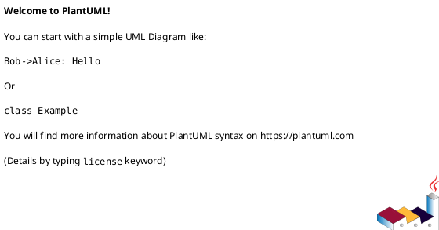

# Module Specification: test_coverage_gap_fillers

* **Source Reference:** `tests/test_coverage_gap_fillers.py`

## 1. Architectural Role & Responsibilities
**Purpose:**
Provides functionality related to test coverage gap fillers.

**Architecture Layer:**
- Infrastructure/Other

**Responsibilities:**
- Not explicitly defined.

**Main Workflow:**
- Not explicitly defined.

## 2. Dependencies
**Imports:**
- `pytest`
- `pandas`
- `json`
- `typing.Any`
- `typing.Dict`
- `unittest.mock.MagicMock`
- `unittest.mock.patch`
- `autogen_team.application.mcp.tools.plan_mission.plan_mission`
- `autogen_team.infrastructure.services.alert_service.AlertsService`
- `autogen_team.core.schemas`
- `autogen_team.models.repositories.ModelRepository`
- `autogen_team.registry.repositories.RegistryRepository`

**Exported Classes:**
- None

**Exported Functions:**
- `test_plan_mission_missing_keys`
- `test_alert_service_exception`
- `test_schemas_main`
- `test_abstract_repositories`

## 3. Architecture & Execution
### Internal Architecture
Not explicitly defined.

### Execution Flow
Not explicitly defined.

### Sequence Explanation
Not explicitly defined.

## 4. UML 2.0 Diagrams
### Class Diagram

### Dependency Graph

```plantuml
@startuml
    [Module] --> [pytest] : imports
    [Module] --> [pandas] : imports
    [Module] --> [json] : imports
    [Module] --> [typing.Any] : imports
    [Module] --> [typing.Dict] : imports
    [Module] --> [unittest.mock.MagicMock] : imports
    [Module] --> [unittest.mock.patch] : imports
    [Module] --> [autogen_team.application.mcp.tools.plan_mission.plan_mission] : imports
    [Module] --> [autogen_team.infrastructure.services.alert_service.AlertsService] : imports
    [Module] --> [autogen_team.core.schemas] : imports
    [Module] --> [autogen_team.models.repositories.ModelRepository] : imports
    [Module] --> [autogen_team.registry.repositories.RegistryRepository] : imports
@enduml
```

## 5. Class & Method Specifications
## 6. Module Functions
### `test_plan_mission_missing_keys()`
Cover lines 53, 55 in plan_mission.py by returning dict with missing keys.

**Inputs:**
- None

**Output:**
- Return Type: `None`

### `test_alert_service_exception()`
Cover lines 27-28 in alert_service.py by triggering notification exception.

**Inputs:**
- None

**Output:**
- Return Type: `None`

### `test_schemas_main()`
Cover lines 103-113 in schemas.py by calling its validation code.

**Inputs:**
- None

**Output:**
- Return Type: `None`

### `test_abstract_repositories()`
Cover repositories.py ABCs with strict type annotations.

**Inputs:**
- None

**Output:**
- Return Type: `None`
