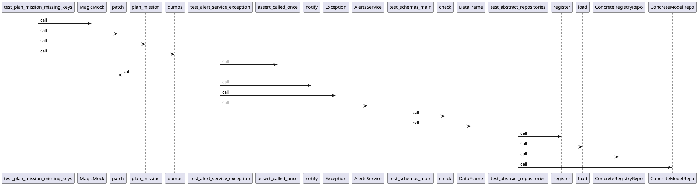
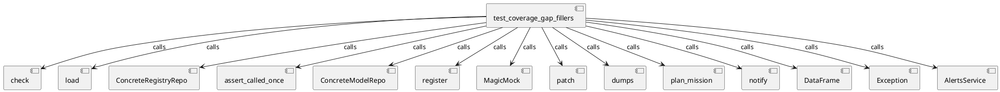

# Module Specification: test_coverage_gap_fillers

* **Source Reference:** `tests/test_coverage_gap_fillers.py`

## 1. Architectural Role & Responsibilities
**Purpose:**
Provides functionality related to test coverage gap fillers.

**Architecture Layer:**
- Infrastructure/Other

**Responsibilities:**
- Manages operations and logic for test coverage gap fillers.

**Main Workflow:**
- Executes the primary flow defined by test coverage gap fillers functions and classes.

## 2. Dependencies
**Imports:**
- `pytest`
- `pandas`
- `json`
- `typing.Any`
- `typing.Dict`
- `unittest.mock.MagicMock`
- `unittest.mock.patch`
- `autogen_team.application.mcp.tools.plan_mission.plan_mission`
- `autogen_team.infrastructure.services.alert_service.AlertsService`
- `autogen_team.core.schemas`
- `autogen_team.models.repositories.ModelRepository`
- `autogen_team.registry.repositories.RegistryRepository`

**Exported Classes:**
- None

**Exported Functions:**
- `test_plan_mission_missing_keys`
- `test_alert_service_exception`
- `test_schemas_main`
- `test_abstract_repositories`

**Exported Interfaces:**
- Not explicitly defined.

**Public API:**
- Not explicitly defined.

## 3. Architecture & Execution
### Internal Architecture
Not explicitly defined.

### Execution Flow
Not explicitly defined.

### Sequence Explanation
Not explicitly defined.

### Examples
Not explicitly defined.

## 4. UML 2.0 Diagrams
### Class Diagram

```plantuml
@startuml
    ' No classes found in module
@enduml
```

### Sequence Diagram

```plantuml
@startuml
    test_plan_mission_missing_keys -> MagicMock : call
    test_plan_mission_missing_keys -> patch : call
    test_plan_mission_missing_keys -> plan_mission : call
    test_plan_mission_missing_keys -> dumps : call
    test_alert_service_exception -> assert_called_once : call
    test_alert_service_exception -> patch : call
    test_alert_service_exception -> notify : call
    test_alert_service_exception -> Exception : call
    test_alert_service_exception -> AlertsService : call
    test_schemas_main -> check : call
    test_schemas_main -> DataFrame : call
    test_abstract_repositories -> register : call
    test_abstract_repositories -> load : call
    test_abstract_repositories -> ConcreteRegistryRepo : call
    test_abstract_repositories -> ConcreteModelRepo : call
@enduml
```

### Component Diagram

```plantuml
@startuml
    package "Infrastructure/Other" {
        [test_coverage_gap_fillers.py]
    }
    [test_coverage_gap_fillers.py] --> [pytest]
    [test_coverage_gap_fillers.py] --> [pandas]
    [test_coverage_gap_fillers.py] --> [json]
    [test_coverage_gap_fillers.py] --> [typing.Any]
    [test_coverage_gap_fillers.py] --> [typing.Dict]
    [test_coverage_gap_fillers.py] --> [unittest.mock.MagicMock]
    [test_coverage_gap_fillers.py] --> [unittest.mock.patch]
    [test_coverage_gap_fillers.py] --> [autogen_team.application.mcp.tools.plan_mission.plan_mission]
    [test_coverage_gap_fillers.py] --> [autogen_team.infrastructure.services.alert_service.AlertsService]
    [test_coverage_gap_fillers.py] --> [autogen_team.core.schemas]
    [test_coverage_gap_fillers.py] --> [autogen_team.models.repositories.ModelRepository]
    [test_coverage_gap_fillers.py] --> [autogen_team.registry.repositories.RegistryRepository]
@enduml
```

### Dependency Graph

```plantuml
@startuml
    [Module] --> [pytest] : imports
    [Module] --> [pandas] : imports
    [Module] --> [json] : imports
    [Module] --> [typing.Any] : imports
    [Module] --> [typing.Dict] : imports
    [Module] --> [unittest.mock.MagicMock] : imports
    [Module] --> [unittest.mock.patch] : imports
    [Module] --> [autogen_team.application.mcp.tools.plan_mission.plan_mission] : imports
    [Module] --> [autogen_team.infrastructure.services.alert_service.AlertsService] : imports
    [Module] --> [autogen_team.core.schemas] : imports
    [Module] --> [autogen_team.models.repositories.ModelRepository] : imports
    [Module] --> [autogen_team.registry.repositories.RegistryRepository] : imports
@enduml
```

## 5. Class & Method Specifications
## 6. Module Functions
### `test_plan_mission_missing_keys()`
Cover lines 53, 55 in plan_mission.py by returning dict with missing keys.

**Inputs:**
- None

**Output:**
- return type: `None`
- semantic meaning: Returns the result of test plan mission missing keys.
- possible null values: Yes, if None allows it.
- exceptions: Standard execution exceptions.

**Side Effects:**
- Database updates: Not explicitly defined.
- File operations: Not explicitly defined.
- Network calls: Not explicitly defined.
- Cache: Not explicitly defined.
- State changes: Not explicitly defined.

### `test_alert_service_exception()`
Cover lines 27-28 in alert_service.py by triggering notification exception.

**Inputs:**
- None

**Output:**
- return type: `None`
- semantic meaning: Returns the result of test alert service exception.
- possible null values: Yes, if None allows it.
- exceptions: Standard execution exceptions.

**Side Effects:**
- Database updates: Not explicitly defined.
- File operations: Not explicitly defined.
- Network calls: Not explicitly defined.
- Cache: Not explicitly defined.
- State changes: Not explicitly defined.

### `test_schemas_main()`
Cover lines 103-113 in schemas.py by calling its validation code.

**Inputs:**
- None

**Output:**
- return type: `None`
- semantic meaning: Returns the result of test schemas main.
- possible null values: Yes, if None allows it.
- exceptions: Standard execution exceptions.

**Side Effects:**
- Database updates: Not explicitly defined.
- File operations: Not explicitly defined.
- Network calls: Not explicitly defined.
- Cache: Not explicitly defined.
- State changes: Not explicitly defined.

### `test_abstract_repositories()`
Cover repositories.py ABCs with strict type annotations.

**Inputs:**
- None

**Output:**
- return type: `None`
- semantic meaning: Returns the result of test abstract repositories.
- possible null values: Yes, if None allows it.
- exceptions: Standard execution exceptions.

**Side Effects:**
- Database updates: Not explicitly defined.
- File operations: Not explicitly defined.
- Network calls: Not explicitly defined.
- Cache: Not explicitly defined.
- State changes: Not explicitly defined.

## 7. Call Graph

```plantuml
@startuml
[test_coverage_gap_fillers] --> [check] : calls
[test_coverage_gap_fillers] --> [load] : calls
[test_coverage_gap_fillers] --> [ConcreteRegistryRepo] : calls
[test_coverage_gap_fillers] --> [assert_called_once] : calls
[test_coverage_gap_fillers] --> [ConcreteModelRepo] : calls
[test_coverage_gap_fillers] --> [register] : calls
[test_coverage_gap_fillers] --> [MagicMock] : calls
[test_coverage_gap_fillers] --> [patch] : calls
[test_coverage_gap_fillers] --> [dumps] : calls
[test_coverage_gap_fillers] --> [plan_mission] : calls
[test_coverage_gap_fillers] --> [notify] : calls
[test_coverage_gap_fillers] --> [DataFrame] : calls
[test_coverage_gap_fillers] --> [Exception] : calls
[test_coverage_gap_fillers] --> [AlertsService] : calls
@enduml
```

## 8. Cross References
- **Parent module:** __init__.md
- **Child modules:** None
- **Dependencies:** `autogen_team.application.mcp.tools.plan_mission.plan_mission`, `pandas`, `pytest`, `autogen_team.registry.repositories.RegistryRepository`, `unittest.mock.patch`, `typing.Dict`, `autogen_team.core.schemas`, `autogen_team.infrastructure.services.alert_service.AlertsService`, `typing.Any`, `autogen_team.models.repositories.ModelRepository`, `json`, `unittest.mock.MagicMock`
- **Used by:** None
- **Calls:** check, load, ConcreteRegistryRepo, assert_called_once, ConcreteModelRepo, register, MagicMock, patch, dumps, plan_mission, notify, DataFrame, Exception, AlertsService
- **Called from:** None
- **Related classes:** [Classes](../../classes/index.md)
- **Related interfaces:** Not explicitly defined.
- **Related diagrams:** [Diagrams](../../diagrams/index.md)
