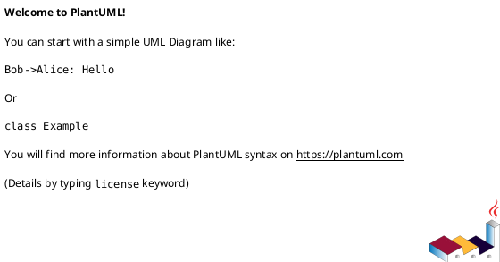

# Module Specification: test_sanity

* **Source Reference:** `tests/test_sanity.py`

## 1. Architectural Role & Responsibilities
**Purpose:**
Provides functionality related to test sanity.

**Architecture Layer:**
- Infrastructure/Other

**Responsibilities:**
- Not explicitly defined.

**Main Workflow:**
- Not explicitly defined.

## 2. Dependencies
**Imports:**
- None

**Exported Classes:**
- None

**Exported Functions:**
- `test_sanity`

## 3. Architecture & Execution
### Internal Architecture
Not explicitly defined.

### Execution Flow
Not explicitly defined.

### Sequence Explanation
Not explicitly defined.

## 4. UML 2.0 Diagrams
### Class Diagram

### Dependency Graph

## 5. Class & Method Specifications
## 6. Module Functions
### `test_sanity()`
No description provided.

**Inputs:**
- None

**Output:**
- Return Type: `None`
