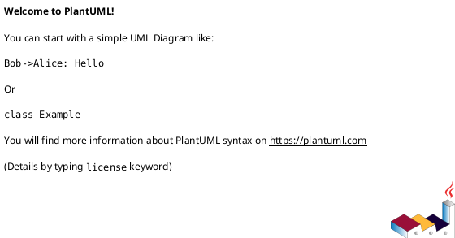
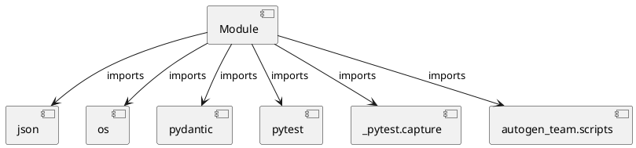

# Module Specification: test_scripts

* **Source Reference:** `tests/test_scripts.py`

## 1. Architectural Role & Responsibilities
**Purpose:**
Provides functionality related to test scripts.

**Architecture Layer:**
- Infrastructure/Other

**Responsibilities:**
- Not explicitly defined.

**Main Workflow:**
- Not explicitly defined.

## 2. Dependencies
**Imports:**
- `json`
- `os`
- `pydantic`
- `pytest`
- `_pytest.capture`
- `autogen_team.scripts`

**Exported Classes:**
- None

**Exported Functions:**
- `test_schema`
- `test_main`
- `test_main__no_configs`

## 3. Architecture & Execution
### Internal Architecture
Not explicitly defined.

### Execution Flow
Not explicitly defined.

### Sequence Explanation
Not explicitly defined.

## 4. UML 2.0 Diagrams
### Class Diagram

### Dependency Graph

## 5. Class & Method Specifications
## 6. Module Functions
### `test_schema(capsys: pc.CaptureFixture[str])`
No description provided.

**Inputs:**
- `capsys`: pc.CaptureFixture[str]

**Output:**
- Return Type: `None`

### `test_main(scenario: str, confs_path: str, extra_config: str)`
No description provided.

**Inputs:**
- `scenario`: str
- `confs_path`: str
- `extra_config`: str

**Output:**
- Return Type: `None`

### `test_main__no_configs()`
No description provided.

**Inputs:**
- None

**Output:**
- Return Type: `None`
