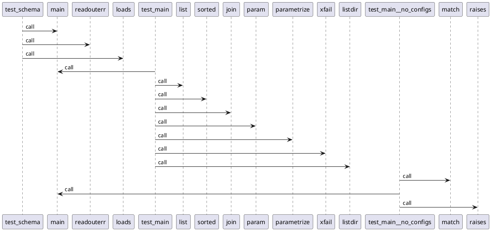
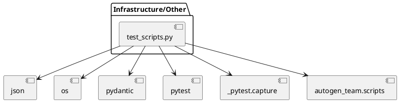
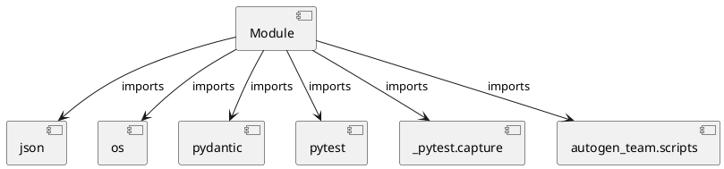
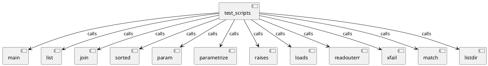

# Module Specification: test_scripts

* **Source Reference:** `tests/test_scripts.py`

## 1. Architectural Role & Responsibilities
**Purpose:**
Provides functionality related to test scripts.

**Architecture Layer:**
- Infrastructure/Other

**Responsibilities:**
- Manages operations and logic for test scripts.

**Main Workflow:**
- Executes the primary flow defined by test scripts functions and classes.

## 2. Dependencies
**Imports:**
- `json`
- `os`
- `pydantic`
- `pytest`
- `_pytest.capture`
- `autogen_team.scripts`

**Exported Classes:**
- None

**Exported Functions:**
- `test_schema`
- `test_main`
- `test_main__no_configs`

**Exported Interfaces:**
- Not explicitly defined.

**Public API:**
- Not explicitly defined.

## 3. Architecture & Execution
### Internal Architecture
Not explicitly defined.

### Execution Flow
Not explicitly defined.

### Sequence Explanation
Not explicitly defined.

### Examples
Not explicitly defined.

## 4. UML 2.0 Diagrams
### Class Diagram

```plantuml
@startuml
    ' No classes found in module
@enduml
```

### Sequence Diagram

```plantuml
@startuml
    test_schema -> main : call
    test_schema -> readouterr : call
    test_schema -> loads : call
    test_main -> main : call
    test_main -> list : call
    test_main -> sorted : call
    test_main -> join : call
    test_main -> param : call
    test_main -> parametrize : call
    test_main -> xfail : call
    test_main -> listdir : call
    test_main__no_configs -> match : call
    test_main__no_configs -> main : call
    test_main__no_configs -> raises : call
@enduml
```

### Component Diagram

```plantuml
@startuml
    package "Infrastructure/Other" {
        [test_scripts.py]
    }
    [test_scripts.py] --> [json]
    [test_scripts.py] --> [os]
    [test_scripts.py] --> [pydantic]
    [test_scripts.py] --> [pytest]
    [test_scripts.py] --> [_pytest.capture]
    [test_scripts.py] --> [autogen_team.scripts]
@enduml
```

### Dependency Graph

```plantuml
@startuml
    [Module] --> [json] : imports
    [Module] --> [os] : imports
    [Module] --> [pydantic] : imports
    [Module] --> [pytest] : imports
    [Module] --> [_pytest.capture] : imports
    [Module] --> [autogen_team.scripts] : imports
@enduml
```

## 5. Class & Method Specifications
## 6. Module Functions
### `test_schema(capsys: pc.CaptureFixture[str])`
Executes the test schema operation.

**Inputs:**
- `capsys`
  - type: pc.CaptureFixture[str]
  - meaning: Represents the capsys parameter.
  - valid values: Any valid pc.CaptureFixture[str].
  - optional?: False
  - default value: None

**Output:**
- return type: `None`
- semantic meaning: Returns the result of test schema.
- possible null values: Yes, if None allows it.
- exceptions: Standard execution exceptions.

**Side Effects:**
- Database updates: Not explicitly defined.
- File operations: Not explicitly defined.
- Network calls: Not explicitly defined.
- Cache: Not explicitly defined.
- State changes: Not explicitly defined.

### `test_main(scenario: str, confs_path: str, extra_config: str)`
Executes the test main operation.

**Inputs:**
- `scenario`
  - type: str
  - meaning: Represents the scenario parameter.
  - valid values: Any valid str.
  - optional?: False
  - default value: None
- `confs_path`
  - type: str
  - meaning: Represents the confs path parameter.
  - valid values: Any valid str.
  - optional?: False
  - default value: None
- `extra_config`
  - type: str
  - meaning: Represents the extra config parameter.
  - valid values: Any valid str.
  - optional?: False
  - default value: None

**Output:**
- return type: `None`
- semantic meaning: Returns the result of test main.
- possible null values: Yes, if None allows it.
- exceptions: Standard execution exceptions.

**Side Effects:**
- Database updates: Not explicitly defined.
- File operations: Not explicitly defined.
- Network calls: Not explicitly defined.
- Cache: Not explicitly defined.
- State changes: Not explicitly defined.

### `test_main__no_configs()`
Executes the test main  no configs operation.

**Inputs:**
- None

**Output:**
- return type: `None`
- semantic meaning: Returns the result of test main  no configs.
- possible null values: Yes, if None allows it.
- exceptions: Standard execution exceptions.

**Side Effects:**
- Database updates: Not explicitly defined.
- File operations: Not explicitly defined.
- Network calls: Not explicitly defined.
- Cache: Not explicitly defined.
- State changes: Not explicitly defined.

## 7. Call Graph

```plantuml
@startuml
[test_scripts] --> [main] : calls
[test_scripts] --> [list] : calls
[test_scripts] --> [join] : calls
[test_scripts] --> [sorted] : calls
[test_scripts] --> [param] : calls
[test_scripts] --> [parametrize] : calls
[test_scripts] --> [raises] : calls
[test_scripts] --> [loads] : calls
[test_scripts] --> [readouterr] : calls
[test_scripts] --> [xfail] : calls
[test_scripts] --> [match] : calls
[test_scripts] --> [listdir] : calls
@enduml
```

## 8. Cross References
- **Parent module:** __init__.md
- **Child modules:** None
- **Dependencies:** `os`, `_pytest.capture`, `pytest`, `autogen_team.scripts`, `json`, `pydantic`
- **Used by:** None
- **Calls:** main, list, join, sorted, param, parametrize, raises, loads, readouterr, xfail, match, listdir
- **Called from:** None
- **Related classes:** [Classes](../../classes/index.md)
- **Related interfaces:** Not explicitly defined.
- **Related diagrams:** [Diagrams](../../diagrams/index.md)
