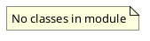

# Document: src/autogen_team/__main__.py

## Module Overview

Entry point of the package.

### Purpose
Provides functionality for `__main__`.

### Responsibilities
Handles operations and definitions related to `__main__`.

### Main Workflow
Execution flow defined by the functions and classes in the module.

### Dependencies
- `autogen_team.scripts`

## Public API

### Exported Classes
None

### Exported Functions
None

## UML Diagram

