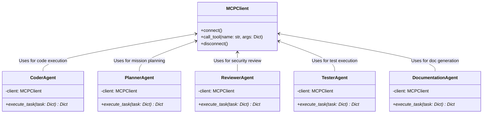
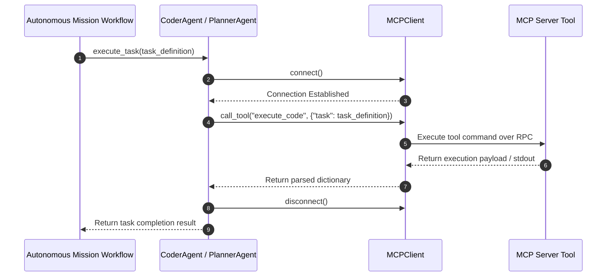

# Module Name: application/agents

* **Source Directory Reference:** `src/autogen_team/application/agents/`
* **Package Dependency:** Upstream: `src/autogen_team/infrastructure/client/mcp_client.py`. Downstream: `src/autogen_team/application/workflows/`.

## 1. Executive Summary & Purpose

The `application/agents` module implements specialized multi-agent roles (`CoderAgent`, `PlannerAgent`, `ReviewerAgent`, `TesterAgent`, `DocumentationAgent`). Each agent encapsulates a specialized responsibility within the multi-agent development lifecycle, communicating asynchronously with the underlying tool ecosystem via `MCPClient`.

## 2. UML 2.0 Class & Inheritance Architecture (Deterministic)

## 3. Package & Class Relations

* **Agent Role Specialization:**
  * `CoderAgent`: Dispatches code execution tasks via MCP tool `execute_code`.
  * `PlannerAgent`: Formulates high-level breakdown plans via MCP tool `plan_mission`.
  * `ReviewerAgent`: Analyzes code vulnerability and quality via MCP tool `security_review`.
  * `TesterAgent`: Executes unit and integration test suites via MCP tool `run_tests`.
  * `DocumentationAgent`: Generates structured markdown specifications via MCP tool `generate_mission_docs`.
* **Lifecycle Management:** All agents initiate an asynchronous MCP session (`connect()`), issue tool requests (`call_tool()`), and release network resources in a `finally` block (`disconnect()`).

## 4. Execution Flow & Runtime Behavior

---

* **Source Citations:**
  * Coder Agent: `src/autogen_team/application/agents/coder_agent.py:6-23`
  * Planner Agent: `src/autogen_team/application/agents/planner_agent.py:6-23`
  * Reviewer Agent: `src/autogen_team/application/agents/reviewer_agent.py:6-23`
  * Tester Agent: `src/autogen_team/application/agents/tester_agent.py:6-23`
  * Documentation Agent: `src/autogen_team/application/agents/documentation_agent.py:6-23`
