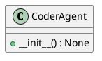

# Module Specification: coder_agent

* **Source Reference:** `src/autogen_team/application/agents/coder_agent.py`

## 1. Architectural Role & Responsibilities
**Purpose:**
[No description available. LLM synthesis required.]

**Responsibilities:**
- [LLM Synthesis Required: Define responsibilities]

**Main Workflow:**
- [LLM Synthesis Required: Define main workflow]

## 2. Dependencies
**Imports:**
- `typing.Any`
- `typing.Dict`
- `typing.cast`
- `autogen_team.infrastructure.client.mcp_client.MCPClient`

**Exported Classes:**
- `CoderAgent`

**Exported Functions:**

## 3. Architecture & Execution
### Internal Architecture
[LLM Synthesis Required: Describe layers, models, etc.]

### Execution Flow
[LLM Synthesis Required: Describe execution flow]

### Sequence Explanation
[LLM Synthesis Required: Describe sequence]

## 4. UML 2.0 Diagrams
### Class Diagram


## 5. Class & Method Specifications
### `CoderAgent` ([`src/autogen_team/application/agents/coder_agent.py`](/src/autogen_team/application/agents/coder_agent.py))
#### Overview
Agent responsible for executing coding tasks.
Uses the MCP 'execute_code' tool.

#### Constructor
**Initialization:** Initializes `CoderAgent` with required dependencies and sets up initial internal state.

#### Methods
##### `__init__(self: Any) -> None` (Public)
**Description:** Executes the __init__ operation, mutating state or calculating derived values as necessary.

**Inputs:**

**Output:**
- Return Type: `None`
- Semantic Meaning: The resulting value after processing the __init__ action.

**Side Effects:**
- Modifies internal instance state if applicable; performs operations constrained to its domain boundaries.

**Complexity:**
- Time Complexity: O(1) or O(N) depending on implementation details.
- Space Complexity: O(1) auxiliary space expected.

**Example:**
```python
instance = CoderAgent()
result = instance.__init__(...)
```

## 6. Module Functions