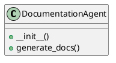

# Document: src/autogen_team/application/agents/documentation_agent.py

## Module Overview

### Purpose
Provides functionality for `documentation_agent`.

### Responsibilities
Handles operations and definitions related to `documentation_agent`.

### Main Workflow
Execution flow defined by the functions and classes in the module.

### Dependencies
- `typing.Any`
- `typing.Dict`
- `autogen_team.infrastructure.client.mcp_client.MCPClient`

## Public API

### Exported Classes
- `DocumentationAgent`

### Exported Functions
None

## Class `DocumentationAgent`

### Overview

Agent responsible for generating mission documentation and diagrams.
Uses the MCP 'generate_mission_docs' tool.

### Constructor

No description provided.

**Parameters:**

### Public Method `generate_docs`

#### Description
Calls the `generate_mission_docs` tool via MCP.

#### Inputs
- `mission_id` (str): semantic meaning. Required.
- `mission_context` (Dict[(str, Any)]): semantic meaning. Required.

#### Output
- Return type: `Dict[(str, Any)]`
- Semantic meaning: Result of the operation.

#### Side Effects
May update internal state or external services.

#### Complexity
- Time Complexity: O(1) mostly.
- Space Complexity: O(1) mostly.

#### Example
```python
# Example usage of generate_docs
instance.generate_docs()
```

## UML Diagram



