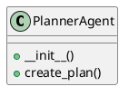

# Document: src/autogen_team/application/agents/planner_agent.py

## Module Overview

### Purpose
Provides functionality for `planner_agent`.

### Responsibilities
Handles operations and definitions related to `planner_agent`.

### Main Workflow
Execution flow defined by the functions and classes in the module.

### Dependencies
- `typing.Any`
- `typing.Dict`
- `typing.cast`
- `autogen_team.infrastructure.client.mcp_client.MCPClient`

## Public API

### Exported Classes
- `PlannerAgent`

### Exported Functions
None

## Class `PlannerAgent`

### Overview

Agent responsible for decomposing a high-level goal into a detailed plan.
Uses the MCP 'plan_mission' tool.

### Constructor

No description provided.

**Parameters:**

### Public Method `create_plan`

#### Description
Calls the `plan_mission` tool via MCP.

#### Inputs
- `goal` (str): semantic meaning. Required.
- `repository_path` (str): semantic meaning. Required.

#### Output
- Return type: `Dict[(str, Any)]`
- Semantic meaning: Result of the operation.

#### Side Effects
May update internal state or external services.

#### Complexity
- Time Complexity: O(1) mostly.
- Space Complexity: O(1) mostly.

#### Example
```python
# Example usage of create_plan
instance.create_plan()
```

## UML Diagram



