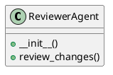

# Document: src/autogen_team/application/agents/reviewer_agent.py

## Module Overview

### Purpose
Provides functionality for `reviewer_agent`.

### Responsibilities
Handles operations and definitions related to `reviewer_agent`.

### Main Workflow
Execution flow defined by the functions and classes in the module.

### Dependencies
- `typing.List`
- `autogen_team.infrastructure.client.mcp_client.MCPClient`
- `autogen_team.infrastructure.messaging.a2a_protocol.ReviewResult`

## Public API

### Exported Classes
- `ReviewerAgent`

### Exported Functions
None

## Class `ReviewerAgent`

### Overview

Agent responsible for reviewing code changes.
Uses the MCP 'security_review' tool.

### Constructor

No description provided.

**Parameters:**

### Public Method `review_changes`

#### Description
Calls the `security_review` tool via MCP.

#### Inputs
- `mission_id` (str): semantic meaning. Required.
- `file_changes` (List[str]): semantic meaning. Required.

#### Output
- Return type: `ReviewResult`
- Semantic meaning: Result of the operation.

#### Side Effects
May update internal state or external services.

#### Complexity
- Time Complexity: O(1) mostly.
- Space Complexity: O(1) mostly.

#### Example
```python
# Example usage of review_changes
instance.review_changes()
```

## UML Diagram



