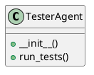

# Document: src/autogen_team/application/agents/tester_agent.py

## Module Overview

### Purpose
Provides functionality for `tester_agent`.

### Responsibilities
Handles operations and definitions related to `tester_agent`.

### Main Workflow
Execution flow defined by the functions and classes in the module.

### Dependencies
- `typing.Any`
- `typing.Dict`
- `typing.cast`
- `autogen_team.infrastructure.client.mcp_client.MCPClient`

## Public API

### Exported Classes
- `TesterAgent`

### Exported Functions
None

## Class `TesterAgent`

### Overview

Agent responsible for running tests.
Uses the MCP 'run_tests' tool.

### Constructor

No description provided.

**Parameters:**

### Public Method `run_tests`

#### Description
No description provided.

#### Inputs
None

#### Output
- Return type: `Dict[(str, Any)]`
- Semantic meaning: Result of the operation.

#### Side Effects
May update internal state or external services.

#### Complexity
- Time Complexity: O(1) mostly.
- Space Complexity: O(1) mostly.

#### Example
```python
# Example usage of run_tests
instance.run_tests()
```

## UML Diagram



