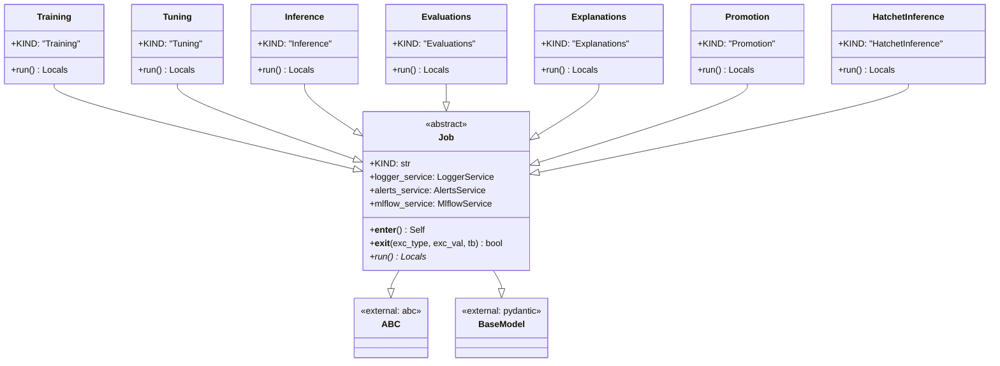
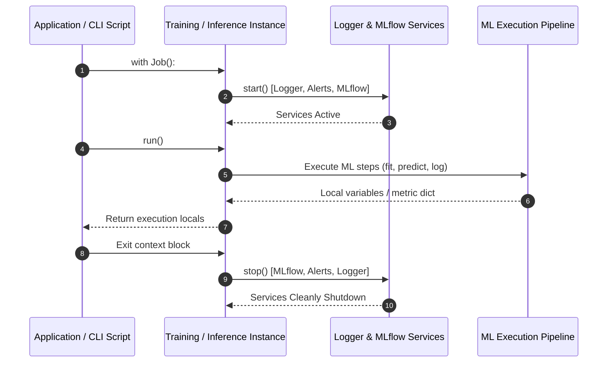

# Module Name: application/jobs

* **Source Directory Reference:** `src/autogen_team/application/jobs/`
* **Package Dependency:** Upstream: `pydantic`, `abc`, `src/autogen_team/infrastructure/services/`. Downstream: CLI entrypoints (`scripts.py`), orchestrators.

## 1. Executive Summary & Purpose

The `application/jobs` module defines the lifecycle execution framework for all high-level operational tasks (Training, Tuning, Inference, Evaluation, Explanation, Model Promotion, Hatchet Inference). Inheriting from `Job` (which uses Python's Context Manager protocol `__enter__`/`__exit__`), jobs automatically start, monitor, and teardown infrastructure services (`LoggerService`, `AlertsService`, `MlflowService`).

## 2. UML 2.0 Class & Inheritance Architecture (Deterministic)

## 3. Package & Class Relations

* **Context Lifecycle (`Job`):** When entering a `with Job()` block, `__enter__` starts `LoggerService`, `AlertsService`, and `MlflowService` in sequence. On exit (`__exit__`), services are cleanly stopped in reverse order, while exceptions are propagated.
* **Job Specialization:**
  * `Training`: Manages dataset loading via `Reader`, model fitting via `Model.fit()`, and artifact registration.
  * `Tuning`: Performs hyperparameter optimization sweeps.
  * `Inference`: Executes model batch predictions using `BaselineAutogenModel`.
  * `Evaluations`: Computes evaluation metrics (`metrics.py`) against target datasets.
  * `Explanations`: Generates SHAP and feature importance explanations (`explain_samples`, `explain_model`).
  * `Promotion`: Evaluates model metrics for staging/production registry promotion.
  * `HatchetInference`: Triggers remote distributed inference via Hatchet workflows.

## 4. Execution Flow & Runtime Behavior

---

* **Source Citations:**
  * Abstract Base Job: `src/autogen_team/application/jobs/base.py:21-86`
  * Training Job: `src/autogen_team/application/jobs/training.py:1-40`
  * Tuning Job: `src/autogen_team/application/jobs/tuning.py:1-40`
  * Inference Job: `src/autogen_team/application/jobs/inference.py:1-40`
  * Evaluation Job: `src/autogen_team/application/jobs/evaluations.py:1-40`
  * Explanations Job: `src/autogen_team/application/jobs/explanations.py:1-40`
  * Promotion Job: `src/autogen_team/application/jobs/promotion.py:1-40`
  * Hatchet Inference Job: `src/autogen_team/application/jobs/hatchet_inference.py:1-40`
