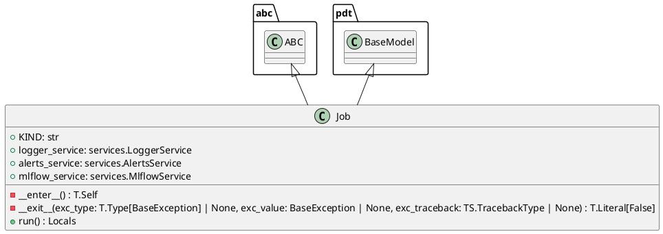

# Module Specification: base

* **Source Reference:** `src/autogen_team/application/jobs/base.py`

## 1. Architectural Role & Responsibilities
**Purpose:**
Base for high-level project jobs.

**Responsibilities:**
- [LLM Synthesis Required: Define responsibilities]

**Main Workflow:**
- [LLM Synthesis Required: Define main workflow]

## 2. Dependencies
**Imports:**
- `abc`
- `types`
- `typing`
- `pydantic`
- `autogen_team.infrastructure.services`

**Exported Classes:**
- `Job`

**Exported Functions:**

## 3. Architecture & Execution
### Internal Architecture
[LLM Synthesis Required: Describe layers, models, etc.]

### Execution Flow
[LLM Synthesis Required: Describe execution flow]

### Sequence Explanation
[LLM Synthesis Required: Describe sequence]

## 4. UML 2.0 Diagrams
### Class Diagram


## 5. Class & Method Specifications
### `Job` ([`src/autogen_team/application/jobs/base.py`](/src/autogen_team/application/jobs/base.py))
#### Overview
Base class for a job.

use a job to execute runs in  context.
e.g., to define common services like logger

Parameters:
    logger_service (services.LoggerService): manage the logger system.
    alerts_service (services.AlertsService): manage the alerts system.
    mlflow_service (services.MlflowService): manage the mlflow system.

#### Constructor
**Initialization:** Default constructor. Initializes an empty instance.

#### Attributes
- `KIND` (`str`): Maintains the state for KIND.
- `logger_service` (`services.LoggerService`): Maintains the state for logger_service.
- `alerts_service` (`services.AlertsService`): Maintains the state for alerts_service.
- `mlflow_service` (`services.MlflowService`): Maintains the state for mlflow_service.

#### Methods
##### `__enter__(self: Any) -> T.Self` (Private)
- **Purpose**: Enter the job context.

Returns:
    T.Self: return the current object.
- **Parameters**:
- **Return value**: `T.Self`

##### `__exit__(self: Any, exc_type: T.Type[BaseException] | None, exc_value: BaseException | None, exc_traceback: TS.TracebackType | None) -> T.Literal[False]` (Private)
- **Purpose**: Exit the job context.

Args:
    exc_type (T.Type[BaseException] | None): ignored.
    exc_value (BaseException | None): ignored.
    exc_traceback (TS.TracebackType | None): ignored.

Returns:
    T.Literal[False]: always propagate exceptions.
- **Parameters**:
  - `exc_type`: Contextual argument for execution.
  - `exc_value`: Contextual argument for execution.
  - `exc_traceback`: Contextual argument for execution.
- **Return value**: `T.Literal[False]`

##### `run(self: Any) -> Locals` (Public)
**Description:** Run the job in context.

Returns:
    Locals: local job variables.

**Inputs:**

**Output:**
- Return Type: `Locals`
- Semantic Meaning: The resulting value after processing the run action.

**Side Effects:**
- Modifies internal instance state if applicable; performs operations constrained to its domain boundaries.

**Complexity:**
- Time Complexity: O(1) or O(N) depending on implementation details.
- Space Complexity: O(1) auxiliary space expected.

**Example:**
```python
instance = Job()
result = instance.run(...)
```

## 6. Module Functions