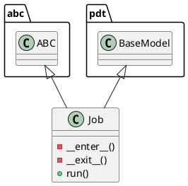

# Document: src/autogen_team/application/jobs/base.py

## Module Overview

Base for high-level project jobs.

### Purpose
Provides functionality for `base`.

### Responsibilities
Handles operations and definitions related to `base`.

### Main Workflow
Execution flow defined by the functions and classes in the module.

### Dependencies
- `abc`
- `types`
- `typing`
- `pydantic`
- `autogen_team.infrastructure.services`

## Public API

### Exported Classes
- `Job`

### Exported Functions
None

## Class `Job`

### Overview

Base class for a job.

use a job to execute runs in  context.
e.g., to define common services like logger

Parameters:
    logger_service (services.LoggerService): manage the logger system.
    alerts_service (services.AlertsService): manage the alerts system.
    mlflow_service (services.MlflowService): manage the mlflow system.

### Attributes

- `KIND` (str): Public property.
- `logger_service` (services.LoggerService): Public property.
- `alerts_service` (services.AlertsService): Public property.
- `mlflow_service` (services.MlflowService): Public property.

### Private Method `__enter__`

**Purpose:** Enter the job context.

Returns:
    T.Self: return the current object.

**Parameters:**

**Return value:**
- `T.Self`

### Private Method `__exit__`

**Purpose:** Exit the job context.

Args:
    exc_type (T.Type[BaseException] | None): ignored.
    exc_value (BaseException | None): ignored.
    exc_traceback (TS.TracebackType | None): ignored.

Returns:
    T.Literal[False]: always propagate exceptions.

**Parameters:**
- `exc_type`: T.Type[BaseException] | None
- `exc_value`: BaseException | None
- `exc_traceback`: TS.TracebackType | None

**Return value:**
- `T.Literal[False]`

### Public Method `run`

#### Description
Run the job in context.

Returns:
    Locals: local job variables.

#### Inputs
None

#### Output
- Return type: `Locals`
- Semantic meaning: Result of the operation.

#### Side Effects
May update internal state or external services.

#### Complexity
- Time Complexity: O(1) mostly.
- Space Complexity: O(1) mostly.

#### Example
```python
# Example usage of run
instance.run()
```

## UML Diagram



