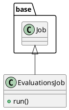

# Document: src/autogen_team/application/jobs/evaluations.py

## Module Overview

Define a job for evaluating registered models with data.

### Purpose
Provides functionality for `evaluations`.

### Responsibilities
Handles operations and definitions related to `evaluations`.

### Main Workflow
Execution flow defined by the functions and classes in the module.

### Dependencies
- `typing`
- `typing.Dict`
- `typing.List`
- `mlflow`
- `pandas`
- `pydantic`
- `autogen_team.application.jobs.base`
- `autogen_team.core.schemas`
- `autogen_team.data_access.adapters.datasets`
- `autogen_team.evaluation.metrics`
- `autogen_team.infrastructure.services`
- `autogen_team.registry.adapters.mlflow_adapter`

## Public API

### Exported Classes
- `EvaluationsJob`

### Exported Functions
None

## Class `EvaluationsJob`

### Overview

Generate evaluations from a registered model and a dataset.

Parameters:
    run_config (services.MlflowService.RunConfig): mlflow run config.
    inputs (datasets.ReaderKind): reader for the inputs data.
    targets (datasets.ReaderKind): reader for the targets data.
    model_type (str): model type (e.g., "regressor", "classifier").
    alias_or_version (str | int): alias or version for the model.
    metrics (metrics_.MetricKind): metrics for the reporting.
    evaluators (list[str]): list of evaluators to use.
    thresholds (dict[str, metrics_.Threshold] | None): metric thresholds.

### Attributes

- `KIND` (T.Literal[EvaluationsJob]): Public property.
- `run_config` (services.MlflowService.RunConfig): Public property.
- `inputs` (datasets.ReaderKind): Public property.
- `targets` (datasets.ReaderKind): Public property.
- `model_type` (str): Public property.
- `alias_or_version` (T.Union[(str, int)]): Public property.
- `metrics` (List[metrics_.AutogenMetric]): Public property.
- `evaluators` (List[str]): Public property.
- `thresholds` (Dict[(str, metrics_.Threshold)]): Public property.

### Public Method `run`

#### Description
No description provided.

#### Inputs
None

#### Output
- Return type: `base.Locals`
- Semantic meaning: Result of the operation.

#### Side Effects
May update internal state or external services.

#### Complexity
- Time Complexity: O(1) mostly.
- Space Complexity: O(1) mostly.

#### Example
```python
# Example usage of run
instance.run()
```

## UML Diagram



