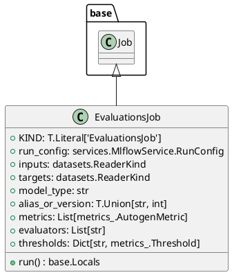

# Module Specification: evaluations

* **Source Reference:** `src/autogen_team/application/jobs/evaluations.py`

## 1. Architectural Role & Responsibilities
**Purpose:**
Define a job for evaluating registered models with data.

**Responsibilities:**
- [LLM Synthesis Required: Define responsibilities]

**Main Workflow:**
- [LLM Synthesis Required: Define main workflow]

## 2. Dependencies
**Imports:**
- `typing`
- `typing.Dict`
- `typing.List`
- `mlflow`
- `pandas`
- `pydantic`
- `autogen_team.application.jobs.base`
- `autogen_team.core.schemas`
- `autogen_team.data_access.adapters.datasets`
- `autogen_team.evaluation.metrics`
- `autogen_team.infrastructure.services`
- `autogen_team.registry.adapters.mlflow_adapter`

**Exported Classes:**
- `EvaluationsJob`

**Exported Functions:**

## 3. Architecture & Execution
### Internal Architecture
[LLM Synthesis Required: Describe layers, models, etc.]

### Execution Flow
[LLM Synthesis Required: Describe execution flow]

### Sequence Explanation
[LLM Synthesis Required: Describe sequence]

## 4. UML 2.0 Diagrams
### Class Diagram


## 5. Class & Method Specifications
### `EvaluationsJob` ([`src/autogen_team/application/jobs/evaluations.py`](/src/autogen_team/application/jobs/evaluations.py))
#### Overview
Generate evaluations from a registered model and a dataset.

Parameters:
    run_config (services.MlflowService.RunConfig): mlflow run config.
    inputs (datasets.ReaderKind): reader for the inputs data.
    targets (datasets.ReaderKind): reader for the targets data.
    model_type (str): model type (e.g., "regressor", "classifier").
    alias_or_version (str | int): alias or version for the model.
    metrics (metrics_.MetricKind): metrics for the reporting.
    evaluators (list[str]): list of evaluators to use.
    thresholds (dict[str, metrics_.Threshold] | None): metric thresholds.

#### Constructor
**Initialization:** Default constructor. Initializes an empty instance.

#### Attributes
- `KIND` (`T.Literal['EvaluationsJob']`): Maintains the state for KIND.
- `run_config` (`services.MlflowService.RunConfig`): Maintains the state for run_config.
- `inputs` (`datasets.ReaderKind`): Maintains the state for inputs.
- `targets` (`datasets.ReaderKind`): Maintains the state for targets.
- `model_type` (`str`): Maintains the state for model_type.
- `alias_or_version` (`T.Union[str, int]`): Maintains the state for alias_or_version.
- `metrics` (`List[metrics_.AutogenMetric]`): Maintains the state for metrics.
- `evaluators` (`List[str]`): Maintains the state for evaluators.
- `thresholds` (`Dict[str, metrics_.Threshold]`): Maintains the state for thresholds.

#### Methods
##### `run(self: Any) -> base.Locals` (Public)
**Description:** Executes the run operation, mutating state or calculating derived values as necessary.

**Inputs:**

**Output:**
- Return Type: `base.Locals`
- Semantic Meaning: The resulting value after processing the run action.

**Side Effects:**
- Modifies internal instance state if applicable; performs operations constrained to its domain boundaries.

**Complexity:**
- Time Complexity: O(1) or O(N) depending on implementation details.
- Space Complexity: O(1) auxiliary space expected.

**Example:**
```python
instance = EvaluationsJob()
result = instance.run(...)
```

## 6. Module Functions