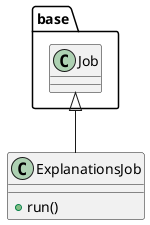

# Document: src/autogen_team/application/jobs/explanations.py

## Module Overview

Define a job for explaining the model structure and decisions.

### Purpose
Provides functionality for `explanations`.

### Responsibilities
Handles operations and definitions related to `explanations`.

### Main Workflow
Execution flow defined by the functions and classes in the module.

### Dependencies
- `typing`
- `pydantic`
- `autogen_team.application.jobs.base`
- `autogen_team.core.schemas`
- `autogen_team.data_access.adapters.datasets`
- `autogen_team.registry.adapters.mlflow_adapter`

## Public API

### Exported Classes
- `ExplanationsJob`

### Exported Functions
None

## Class `ExplanationsJob`

### Overview

Generate explanations from the model and a data sample.

Parameters:
    inputs_samples (datasets.ReaderKind): reader for the samples data.
    models_explanations (datasets.WriterKind): writer for models explanation.
    samples_explanations (datasets.WriterKind): writer for samples explanation.
    alias_or_version (str | int): alias or version for the  model.
    loader (registries.LoaderKind): registry loader for the model.

### Attributes

- `KIND` (T.Literal[ExplanationsJob]): Public property.
- `inputs_samples` (datasets.ReaderKind): Public property.
- `models_explanations` (datasets.WriterKind): Public property.
- `samples_explanations` (datasets.WriterKind): Public property.
- `alias_or_version` (str | int): Public property.
- `loader` (registries.LoaderKind): Public property.

### Public Method `run`

#### Description
No description provided.

#### Inputs
None

#### Output
- Return type: `base.Locals`
- Semantic meaning: Result of the operation.

#### Side Effects
May update internal state or external services.

#### Complexity
- Time Complexity: O(1) mostly.
- Space Complexity: O(1) mostly.

#### Example
```python
# Example usage of run
instance.run()
```

## UML Diagram



