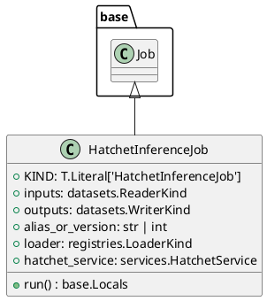

# Module Specification: hatchet_inference

* **Source Reference:** `src/autogen_team/application/jobs/hatchet_inference.py`

## 1. Architectural Role & Responsibilities
**Purpose:**
Define a job for triggering a Hatchet inference workflow.

**Responsibilities:**
- [LLM Synthesis Required: Define responsibilities]

**Main Workflow:**
- [LLM Synthesis Required: Define main workflow]

## 2. Dependencies
**Imports:**
- `typing`
- `pydantic`
- `autogen_team.application.jobs.base`
- `autogen_team.data_access.adapters.datasets`
- `autogen_team.infrastructure.services`
- `autogen_team.registry.adapters.mlflow_adapter`

**Exported Classes:**
- `HatchetInferenceJob`

**Exported Functions:**

## 3. Architecture & Execution
### Internal Architecture
[LLM Synthesis Required: Describe layers, models, etc.]

### Execution Flow
[LLM Synthesis Required: Describe execution flow]

### Sequence Explanation
[LLM Synthesis Required: Describe sequence]

## 4. UML 2.0 Diagrams
### Class Diagram


## 5. Class & Method Specifications
### `HatchetInferenceJob` ([`src/autogen_team/application/jobs/hatchet_inference.py`](/src/autogen_team/application/jobs/hatchet_inference.py))
#### Overview
Trigger a Hatchet inference workflow.

This job acts as a client-side proxy that starts the asynchronous
inference process in the Hatchet engine.

Parameters:
    inputs (datasets.ReaderKind): reader for the inputs data.
    outputs (datasets.WriterKind): writer for the outputs data.
    alias_or_version (str | int): alias or version for the model.
    loader (registries.LoaderKind): registry loader for the model.
    hatchet_service (services.HatchetService): manage the Hatchet system.

#### Constructor
**Initialization:** Default constructor. Initializes an empty instance.

#### Attributes
- `KIND` (`T.Literal['HatchetInferenceJob']`): Maintains the state for KIND.
- `inputs` (`datasets.ReaderKind`): Maintains the state for inputs.
- `outputs` (`datasets.WriterKind`): Maintains the state for outputs.
- `alias_or_version` (`str | int`): Maintains the state for alias_or_version.
- `loader` (`registries.LoaderKind`): Maintains the state for loader.
- `hatchet_service` (`services.HatchetService`): Maintains the state for hatchet_service.

#### Methods
##### `run(self: Any) -> base.Locals` (Public)
**Description:** Executes the run operation, mutating state or calculating derived values as necessary.

**Inputs:**

**Output:**
- Return Type: `base.Locals`
- Semantic Meaning: The resulting value after processing the run action.

**Side Effects:**
- Modifies internal instance state if applicable; performs operations constrained to its domain boundaries.

**Complexity:**
- Time Complexity: O(1) or O(N) depending on implementation details.
- Space Complexity: O(1) auxiliary space expected.

**Example:**
```python
instance = HatchetInferenceJob()
result = instance.run(...)
```

## 6. Module Functions