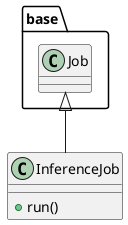

# Document: src/autogen_team/application/jobs/inference.py

## Module Overview

Define a job for generating batch predictions from a registered model.

### Purpose
Provides functionality for `inference`.

### Responsibilities
Handles operations and definitions related to `inference`.

### Main Workflow
Execution flow defined by the functions and classes in the module.

### Dependencies
- `typing`
- `pandas`
- `pydantic`
- `autogen_team.application.jobs.base`
- `autogen_team.core.schemas`
- `autogen_team.data_access.adapters.datasets`
- `autogen_team.registry.adapters.mlflow_adapter`

## Public API

### Exported Classes
- `InferenceJob`

### Exported Functions
None

## Class `InferenceJob`

### Overview

Generate batch predictions from a registered model.

Parameters:
    inputs (datasets.ReaderKind): reader for the inputs data.
    outputs (datasets.WriterKind): writer for the outputs data.
    alias_or_version (str | int): alias or version for the  model.
    loader (registries.LoaderKind): registry loader for the model.

### Attributes

- `KIND` (T.Literal[InferenceJob]): Public property.
- `inputs` (datasets.ReaderKind): Public property.
- `outputs` (datasets.WriterKind): Public property.
- `alias_or_version` (str | int): Public property.
- `loader` (registries.LoaderKind): Public property.

### Public Method `run`

#### Description
No description provided.

#### Inputs
None

#### Output
- Return type: `base.Locals`
- Semantic meaning: Result of the operation.

#### Side Effects
May update internal state or external services.

#### Complexity
- Time Complexity: O(1) mostly.
- Space Complexity: O(1) mostly.

#### Example
```python
# Example usage of run
instance.run()
```

## UML Diagram



