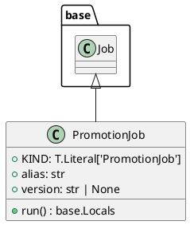

# Module Specification: promotion

* **Source Reference:** `src/autogen_team/application/jobs/promotion.py`

## 1. Architectural Role & Responsibilities
**Purpose:**
Define a job for promoting a registered model version with an alias.

**Responsibilities:**
- [LLM Synthesis Required: Define responsibilities]

**Main Workflow:**
- [LLM Synthesis Required: Define main workflow]

## 2. Dependencies
**Imports:**
- `typing`
- `autogen_team.application.jobs.base`

**Exported Classes:**
- `PromotionJob`

**Exported Functions:**

## 3. Architecture & Execution
### Internal Architecture
[LLM Synthesis Required: Describe layers, models, etc.]

### Execution Flow
[LLM Synthesis Required: Describe execution flow]

### Sequence Explanation
[LLM Synthesis Required: Describe sequence]

## 4. UML 2.0 Diagrams
### Class Diagram


## 5. Class & Method Specifications
### `PromotionJob` ([`src/autogen_team/application/jobs/promotion.py`](/src/autogen_team/application/jobs/promotion.py))
#### Overview
Define a job for promoting a registered model version with an alias.

https://mlflow.org/docs/latest/model-registry.html#concepts

Parameters:
    alias (str): the mlflow alias to transition the registered model version.
    version (int | None): the model version to transition (use None for latest).

#### Constructor
**Initialization:** Default constructor. Initializes an empty instance.

#### Attributes
- `KIND` (`T.Literal['PromotionJob']`): Maintains the state for KIND.
- `alias` (`str`): Maintains the state for alias.
- `version` (`str | None`): Maintains the state for version.

#### Methods
##### `run(self: Any) -> base.Locals` (Public)
**Description:** Executes the run operation, mutating state or calculating derived values as necessary.

**Inputs:**

**Output:**
- Return Type: `base.Locals`
- Semantic Meaning: The resulting value after processing the run action.

**Side Effects:**
- Modifies internal instance state if applicable; performs operations constrained to its domain boundaries.

**Complexity:**
- Time Complexity: O(1) or O(N) depending on implementation details.
- Space Complexity: O(1) auxiliary space expected.

**Example:**
```python
instance = PromotionJob()
result = instance.run(...)
```

## 6. Module Functions