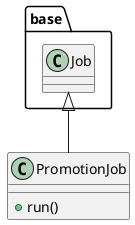

# Document: src/autogen_team/application/jobs/promotion.py

## Module Overview

Define a job for promoting a registered model version with an alias.

### Purpose
Provides functionality for `promotion`.

### Responsibilities
Handles operations and definitions related to `promotion`.

### Main Workflow
Execution flow defined by the functions and classes in the module.

### Dependencies
- `typing`
- `autogen_team.application.jobs.base`

## Public API

### Exported Classes
- `PromotionJob`

### Exported Functions
None

## Class `PromotionJob`

### Overview

Define a job for promoting a registered model version with an alias.

https://mlflow.org/docs/latest/model-registry.html#concepts

Parameters:
    alias (str): the mlflow alias to transition the registered model version.
    version (int | None): the model version to transition (use None for latest).

### Attributes

- `KIND` (T.Literal[PromotionJob]): Public property.
- `alias` (str): Public property.
- `version` (str | None): Public property.

### Public Method `run`

#### Description
No description provided.

#### Inputs
None

#### Output
- Return type: `base.Locals`
- Semantic meaning: Result of the operation.

#### Side Effects
May update internal state or external services.

#### Complexity
- Time Complexity: O(1) mostly.
- Space Complexity: O(1) mostly.

#### Example
```python
# Example usage of run
instance.run()
```

## UML Diagram



