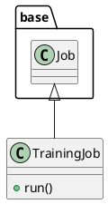

# Document: src/autogen_team/application/jobs/training.py

## Module Overview

Define a job for training and registring a single AI/ML model.

### Purpose
Provides functionality for `training`.

### Responsibilities
Handles operations and definitions related to `training`.

### Main Workflow
Execution flow defined by the functions and classes in the module.

### Dependencies
- `typing`
- `mlflow`
- `pydantic`
- `autogen_team.application.jobs.base`
- `autogen_team.core.schemas`
- `autogen_team.data_access.adapters.datasets`
- `autogen_team.evaluation.metrics.metrics`
- `autogen_team.infrastructure.services`
- `autogen_team.infrastructure.utils.signers`
- `autogen_team.infrastructure.utils.splitters`
- `autogen_team.models.entities`
- `autogen_team.registry.adapters.mlflow_adapter`

## Public API

### Exported Classes
- `TrainingJob`

### Exported Functions
None

## Class `TrainingJob`

### Overview

Train and register a single AI/ML model.

Parameters:
    run_config (services.MlflowService.RunConfig): mlflow run config.
    inputs (datasets.ReaderKind): reader for the inputs data.
    targets (datasets.ReaderKind): reader for the targets data.
    model (models.ModelKind): machine learning model to train.
    metrics (metrics_.MetricKind): metrics for the reporting.
    splitter (splitters.SplitterKind): data sets splitter.
    saver (registries.SaverKind): model saver.
    signer (signers.SignerKind): model signer.
    registry (registries.RegisterKind): model register.

### Attributes

- `KIND` (T.Literal[TrainingJob]): Public property.
- `run_config` (services.MlflowService.RunConfig): Public property.
- `inputs` (datasets.ReaderKind): Public property.
- `targets` (datasets.ReaderKind): Public property.
- `model` (models.ModelKind): Public property.
- `metrics` (metrics_.MetricsKind): Public property.
- `splitter` (splitters.SplitterKind): Public property.
- `saver` (registries.SaverKind): Public property.
- `signer` (signers.SignerKind): Public property.
- `registry` (registries.RegisterKind): Public property.

### Public Method `run`

#### Description
No description provided.

#### Inputs
None

#### Output
- Return type: `base.Locals`
- Semantic meaning: Result of the operation.

#### Side Effects
May update internal state or external services.

#### Complexity
- Time Complexity: O(1) mostly.
- Space Complexity: O(1) mostly.

#### Example
```python
# Example usage of run
instance.run()
```

## UML Diagram



