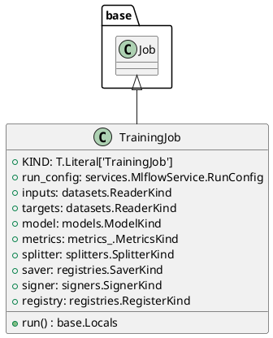

# Module Specification: training

* **Source Reference:** `src/autogen_team/application/jobs/training.py`

## 1. Architectural Role & Responsibilities
**Purpose:**
Define a job for training and registring a single AI/ML model.

**Responsibilities:**
- [LLM Synthesis Required: Define responsibilities]

**Main Workflow:**
- [LLM Synthesis Required: Define main workflow]

## 2. Dependencies
**Imports:**
- `typing`
- `mlflow`
- `pydantic`
- `autogen_team.application.jobs.base`
- `autogen_team.core.schemas`
- `autogen_team.data_access.adapters.datasets`
- `autogen_team.evaluation.metrics.metrics`
- `autogen_team.infrastructure.services`
- `autogen_team.infrastructure.utils.signers`
- `autogen_team.infrastructure.utils.splitters`
- `autogen_team.models.entities`
- `autogen_team.registry.adapters.mlflow_adapter`

**Exported Classes:**
- `TrainingJob`

**Exported Functions:**

## 3. Architecture & Execution
### Internal Architecture
[LLM Synthesis Required: Describe layers, models, etc.]

### Execution Flow
[LLM Synthesis Required: Describe execution flow]

### Sequence Explanation
[LLM Synthesis Required: Describe sequence]

## 4. UML 2.0 Diagrams
### Class Diagram


## 5. Class & Method Specifications
### `TrainingJob` ([`src/autogen_team/application/jobs/training.py`](/src/autogen_team/application/jobs/training.py))
#### Overview
Train and register a single AI/ML model.

Parameters:
    run_config (services.MlflowService.RunConfig): mlflow run config.
    inputs (datasets.ReaderKind): reader for the inputs data.
    targets (datasets.ReaderKind): reader for the targets data.
    model (models.ModelKind): machine learning model to train.
    metrics (metrics_.MetricKind): metrics for the reporting.
    splitter (splitters.SplitterKind): data sets splitter.
    saver (registries.SaverKind): model saver.
    signer (signers.SignerKind): model signer.
    registry (registries.RegisterKind): model register.

#### Constructor
**Initialization:** Default constructor. Initializes an empty instance.

#### Attributes
- `KIND` (`T.Literal['TrainingJob']`): Maintains the state for KIND.
- `run_config` (`services.MlflowService.RunConfig`): Maintains the state for run_config.
- `inputs` (`datasets.ReaderKind`): Maintains the state for inputs.
- `targets` (`datasets.ReaderKind`): Maintains the state for targets.
- `model` (`models.ModelKind`): Maintains the state for model.
- `metrics` (`metrics_.MetricsKind`): Maintains the state for metrics.
- `splitter` (`splitters.SplitterKind`): Maintains the state for splitter.
- `saver` (`registries.SaverKind`): Maintains the state for saver.
- `signer` (`signers.SignerKind`): Maintains the state for signer.
- `registry` (`registries.RegisterKind`): Maintains the state for registry.

#### Methods
##### `run(self: Any) -> base.Locals` (Public)
**Description:** Executes the run operation, mutating state or calculating derived values as necessary.

**Inputs:**

**Output:**
- Return Type: `base.Locals`
- Semantic Meaning: The resulting value after processing the run action.

**Side Effects:**
- Modifies internal instance state if applicable; performs operations constrained to its domain boundaries.

**Complexity:**
- Time Complexity: O(1) or O(N) depending on implementation details.
- Space Complexity: O(1) auxiliary space expected.

**Example:**
```python
instance = TrainingJob()
result = instance.run(...)
```

## 6. Module Functions