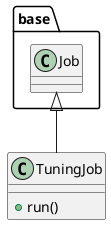

# Document: src/autogen_team/application/jobs/tuning.py

## Module Overview

Define a job for finding the best hyperparameters for a model.

### Purpose
Provides functionality for `tuning`.

### Responsibilities
Handles operations and definitions related to `tuning`.

### Main Workflow
Execution flow defined by the functions and classes in the module.

### Dependencies
- `typing`
- `mlflow`
- `pydantic`
- `autogen_team.application.jobs.base`
- `autogen_team.core.schemas`
- `autogen_team.data_access.adapters.datasets`
- `autogen_team.evaluation.metrics`
- `autogen_team.infrastructure.services`
- `autogen_team.infrastructure.utils.searchers`
- `autogen_team.infrastructure.utils.splitters`
- `autogen_team.models.entities`

## Public API

### Exported Classes
- `TuningJob`

### Exported Functions
None

## Class `TuningJob`

### Overview

Find the best hyperparameters for a model.
https://microsoft.github.io/FLAML/docs/Examples/AutoGen-OpenAI/
https://github.com/microsoft/FLAML/blob/main/notebook/autogen_openai_completion.ipynb

Parameters:
    run_config (services.MlflowService.RunConfig): mlflow run config.
    inputs (datasets.ReaderKind): reader for the inputs data.
    targets (datasets.ReaderKind): reader for the targets data.
    model (models.ModelKind): machine learning model to tune.
    metric (metrics.MetricKind): tuning metric to optimize.
    splitter (splitters.SplitterKind): data sets splitter.
    searcher: (searchers.SearcherKind): hparams searcher.

### Attributes

- `KIND` (T.Literal[TuningJob]): Public property.
- `run_config` (services.MlflowService.RunConfig): Public property.
- `inputs` (datasets.ReaderKind): Public property.
- `targets` (datasets.ReaderKind): Public property.
- `model` (models.ModelKind): Public property.
- `metric` (metrics.MetricKind): Public property.
- `splitter` (splitters.SplitterKind): Public property.
- `searcher` (searchers.SearcherKind): Public property.

### Public Method `run`

#### Description
Run the tuning job in context.

#### Inputs
None

#### Output
- Return type: `base.Locals`
- Semantic meaning: Result of the operation.

#### Side Effects
May update internal state or external services.

#### Complexity
- Time Complexity: O(1) mostly.
- Space Complexity: O(1) mostly.

#### Example
```python
# Example usage of run
instance.run()
```

## UML Diagram



