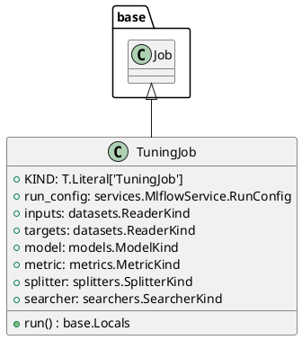

# Module Specification: tuning

* **Source Reference:** `src/autogen_team/application/jobs/tuning.py`

## 1. Architectural Role & Responsibilities
**Purpose:**
Define a job for finding the best hyperparameters for a model.

**Responsibilities:**
- [LLM Synthesis Required: Define responsibilities]

**Main Workflow:**
- [LLM Synthesis Required: Define main workflow]

## 2. Dependencies
**Imports:**
- `typing`
- `mlflow`
- `pydantic`
- `autogen_team.application.jobs.base`
- `autogen_team.core.schemas`
- `autogen_team.data_access.adapters.datasets`
- `autogen_team.evaluation.metrics`
- `autogen_team.infrastructure.services`
- `autogen_team.infrastructure.utils.searchers`
- `autogen_team.infrastructure.utils.splitters`
- `autogen_team.models.entities`

**Exported Classes:**
- `TuningJob`

**Exported Functions:**

## 3. Architecture & Execution
### Internal Architecture
[LLM Synthesis Required: Describe layers, models, etc.]

### Execution Flow
[LLM Synthesis Required: Describe execution flow]

### Sequence Explanation
[LLM Synthesis Required: Describe sequence]

## 4. UML 2.0 Diagrams
### Class Diagram


## 5. Class & Method Specifications
### `TuningJob` ([`src/autogen_team/application/jobs/tuning.py`](/src/autogen_team/application/jobs/tuning.py))
#### Overview
Find the best hyperparameters for a model.
https://microsoft.github.io/FLAML/docs/Examples/AutoGen-OpenAI/
https://github.com/microsoft/FLAML/blob/main/notebook/autogen_openai_completion.ipynb

Parameters:
    run_config (services.MlflowService.RunConfig): mlflow run config.
    inputs (datasets.ReaderKind): reader for the inputs data.
    targets (datasets.ReaderKind): reader for the targets data.
    model (models.ModelKind): machine learning model to tune.
    metric (metrics.MetricKind): tuning metric to optimize.
    splitter (splitters.SplitterKind): data sets splitter.
    searcher: (searchers.SearcherKind): hparams searcher.

#### Constructor
**Initialization:** Default constructor. Initializes an empty instance.

#### Attributes
- `KIND` (`T.Literal['TuningJob']`): Maintains the state for KIND.
- `run_config` (`services.MlflowService.RunConfig`): Maintains the state for run_config.
- `inputs` (`datasets.ReaderKind`): Maintains the state for inputs.
- `targets` (`datasets.ReaderKind`): Maintains the state for targets.
- `model` (`models.ModelKind`): Maintains the state for model.
- `metric` (`metrics.MetricKind`): Maintains the state for metric.
- `splitter` (`splitters.SplitterKind`): Maintains the state for splitter.
- `searcher` (`searchers.SearcherKind`): Maintains the state for searcher.

#### Methods
##### `run(self: Any) -> base.Locals` (Public)
**Description:** Run the tuning job in context.

**Inputs:**

**Output:**
- Return Type: `base.Locals`
- Semantic Meaning: The resulting value after processing the run action.

**Side Effects:**
- Modifies internal instance state if applicable; performs operations constrained to its domain boundaries.

**Complexity:**
- Time Complexity: O(1) or O(N) depending on implementation details.
- Space Complexity: O(1) auxiliary space expected.

**Example:**
```python
instance = TuningJob()
result = instance.run(...)
```

## 6. Module Functions