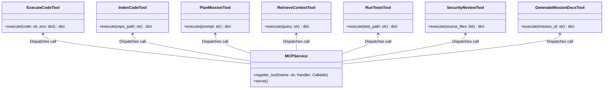
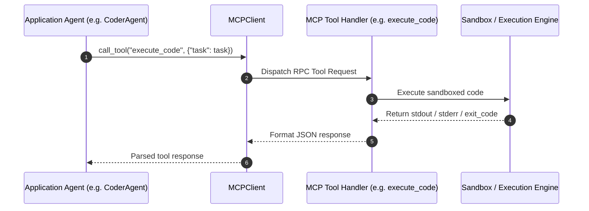

# Module Name: application/mcp

* **Source Directory Reference:** `src/autogen_team/application/mcp/`
* **Package Dependency:** Upstream: `src/autogen_team/infrastructure/services/mcp_service.py`, `src/autogen_team/core/security.py`. Downstream: `src/autogen_team/application/agents/`.

## 1. Executive Summary & Purpose

The `application/mcp` module provides tool endpoints exposed over the Model Context Protocol (MCP). These tools provide agent access to code execution, code indexing, test execution, security code review, mission planning, context retrieval, and documentation generation.

## 2. UML 2.0 Class & Tool Structure (Deterministic)

## 3. Package & Class Relations

* **Tool Functions & Handlers:**
  * `execute_code.py`: Executes Python snippets in an isolated process or sandbox.
  * `index_code.py`: Parses repository source trees into AST topologies and symbol tables.
  * `plan_mission.py`: Generates step-by-step implementation plans for complex missions.
  * `retrieve_context.py`: Queries repository vector/symbol indices for relevant code snippets.
  * `run_tests.py`: Runs pytest or unittest suites and returns JSON results.
  * `security_review.py`: Performs static AST vulnerability analysis on source code.
  * `generate_mission_docs.py`: Produces structured mission documentation.

## 4. Execution Flow & Runtime Behavior

---

* **Source Citations:**
  * Execute Code Tool: `src/autogen_team/application/mcp/tools/execute_code.py:1-25`
  * Index Code Tool: `src/autogen_team/application/mcp/tools/index_code.py:1-25`
  * Plan Mission Tool: `src/autogen_team/application/mcp/tools/plan_mission.py:1-25`
  * Retrieve Context Tool: `src/autogen_team/application/mcp/tools/retrieve_context.py:1-25`
  * Run Tests Tool: `src/autogen_team/application/mcp/tools/run_tests.py:1-25`
  * Security Review Tool: `src/autogen_team/application/mcp/tools/security_review.py:1-25`
  * Generate Mission Docs Tool: `src/autogen_team/application/mcp/tools/generate_mission_docs.py:1-25`
