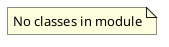

# Document: src/autogen_team/application/mcp/tools/__init__.py

## Module Overview

MCP Tool implementations.

### Purpose
Provides functionality for `__init__`.

### Responsibilities
Handles operations and definitions related to `__init__`.

### Main Workflow
Execution flow defined by the functions and classes in the module.

### Dependencies
- `execute_code.execute_code`
- `index_code.index_code`
- `plan_mission.plan_mission`
- `retrieve_context.retrieve_context`
- `run_tests.run_tests`
- `security_review.security_review`
- `generate_mission_docs.generate_mission_docs`

## Public API

### Exported Classes
None

### Exported Functions
None

## UML Diagram

