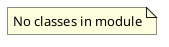

# Document: src/autogen_team/application/mcp/tools/execute_code.py

## Module Overview

Execute Code tool — generates code changes and validates in sandbox.

### Purpose
Provides functionality for `execute_code`.

### Responsibilities
Handles operations and definitions related to `execute_code`.

### Main Workflow
Execution flow defined by the functions and classes in the module.

### Dependencies
- `__future__.annotations`
- `json`
- `os`
- `py_compile`
- `shutil`
- `tempfile`
- `typing`
- `loguru.logger`
- `litellm`
- `autogen_team.core.security.safe_join`
- `autogen_team.infrastructure.services.mcp_service.MCPService`

## Public API

### Exported Classes
None

### Exported Functions
- `execute_code`

## Public Function `execute_code`

### Description
Generate code changes for a task and validate in sandbox.

Args:
    task: A task dict (from DAG) with id, name, description.
    workspace_path: Path to the workspace root.

Returns:
    A dict with files_changed list and status.

### Inputs
- `task` (T.Dict[(str, T.Any)]): semantic meaning. Required.
- `workspace_path` (str): semantic meaning. Required.

### Output
- Return type: `T.Dict[(str, T.Any)]`
- Semantic meaning: Result of the operation.

### Side Effects
May update state or affect global resources.

### Complexity
- Time Complexity: O(1) mostly.
- Space Complexity: O(1) mostly.

### Example
```python
# Example usage of execute_code
execute_code()
```

## UML Diagram



