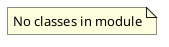

# Document: src/autogen_team/application/mcp/tools/generate_mission_docs.py

## Module Overview

Generate Mission Documentation tool — creates Mermaid diagrams from mission results.

### Purpose
Provides functionality for `generate_mission_docs`.

### Responsibilities
Handles operations and definitions related to `generate_mission_docs`.

### Main Workflow
Execution flow defined by the functions and classes in the module.

### Dependencies
- `__future__.annotations`
- `json`
- `typing`
- `litellm`
- `autogen_team.infrastructure.services.mcp_service.MCPService`

## Public API

### Exported Classes
None

### Exported Functions
- `generate_mission_docs`

## Public Function `generate_mission_docs`

### Description
Generate Mermaid diagrams and documentation for a mission.

Args:
    mission_id: Unique identifier for the mission.
    mission_context: Context including goal, tasks, results, and file changes.

Returns:
    A dict containing generated Mermaid diagrams and documentation.

### Inputs
- `mission_id` (str): semantic meaning. Required.
- `mission_context` (T.Dict[(str, T.Any)]): semantic meaning. Required.

### Output
- Return type: `T.Dict[(str, T.Any)]`
- Semantic meaning: Result of the operation.

### Side Effects
May update state or affect global resources.

### Complexity
- Time Complexity: O(1) mostly.
- Space Complexity: O(1) mostly.

### Example
```python
# Example usage of generate_mission_docs
generate_mission_docs()
```

## UML Diagram



