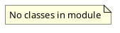

# Document: src/autogen_team/application/mcp/tools/index_code.py

## Module Overview

Index Code tool — indexes code files into R2R knowledge graph.

### Purpose
Provides functionality for `index_code`.

### Responsibilities
Handles operations and definitions related to `index_code`.

### Main Workflow
Execution flow defined by the functions and classes in the module.

### Dependencies
- `__future__.annotations`
- `typing`
- `loguru.logger`
- `httpx`
- `autogen_team.infrastructure.io.osvariables.Env`

## Public API

### Exported Classes
None

### Exported Functions
- `index_code`

## Public Function `index_code`

### Description
Index a code file into R2R knowledge graph for future retrieval.

Args:
    file_path: Path of the file being indexed.
    content: Full content of the file.
    metadata: Optional metadata dict (language, author, etc).

Returns:
    Dict with document_id and status.

### Inputs
- `file_path` (str): semantic meaning. Required.
- `content` (str): semantic meaning. Required.
- `metadata` (T.Dict[(str, T.Any)] | None): semantic meaning. Optional (default: `None`).

### Output
- Return type: `T.Dict[(str, T.Any)]`
- Semantic meaning: Result of the operation.

### Side Effects
May update state or affect global resources.

### Complexity
- Time Complexity: O(1) mostly.
- Space Complexity: O(1) mostly.

### Example
```python
# Example usage of index_code
index_code()
```

## UML Diagram



