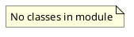

# Document: src/autogen_team/application/mcp/tools/plan_mission.py

## Module Overview

Plan Mission tool — decomposes a high-level goal into a task DAG using LiteLLM.

### Purpose
Provides functionality for `plan_mission`.

### Responsibilities
Handles operations and definitions related to `plan_mission`.

### Main Workflow
Execution flow defined by the functions and classes in the module.

### Dependencies
- `__future__.annotations`
- `json`
- `typing`
- `litellm`
- `autogen_team.infrastructure.services.mcp_service.MCPService`

## Public API

### Exported Classes
None

### Exported Functions
- `plan_mission`

## Public Function `plan_mission`

### Description
Decompose a high-level goal into a task DAG.

Args:
    goal: A high-level goal string to decompose.

Returns:
    A dict representing the task DAG with parallel_tasks array.

### Inputs
- `goal` (str): semantic meaning. Required.

### Output
- Return type: `T.Dict[(str, T.Any)]`
- Semantic meaning: Result of the operation.

### Side Effects
May update state or affect global resources.

### Complexity
- Time Complexity: O(1) mostly.
- Space Complexity: O(1) mostly.

### Example
```python
# Example usage of plan_mission
plan_mission()
```

## UML Diagram



