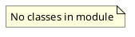

# Document: src/autogen_team/application/mcp/tools/retrieve_context.py

## Module Overview

Retrieve Context tool — queries R2R RAG for relevant codebase patterns.

### Purpose
Provides functionality for `retrieve_context`.

### Responsibilities
Handles operations and definitions related to `retrieve_context`.

### Main Workflow
Execution flow defined by the functions and classes in the module.

### Dependencies
- `__future__.annotations`
- `typing`
- `loguru.logger`
- `httpx`
- `autogen_team.infrastructure.io.osvariables.Env`

## Public API

### Exported Classes
None

### Exported Functions
- `retrieve_context`

## Public Function `retrieve_context`

### Description
Query R2R RAG system for relevant codebase patterns via semantic search.

Args:
    query: Search query string.
    collection_name: Name of the R2R collection to search.

Returns:
    Dict with matching documents and graph context.

### Inputs
- `query` (str): semantic meaning. Required.
- `collection_name` (str): semantic meaning. Optional (default: `'default'`).

### Output
- Return type: `T.Dict[(str, T.Any)]`
- Semantic meaning: Result of the operation.

### Side Effects
May update state or affect global resources.

### Complexity
- Time Complexity: O(1) mostly.
- Space Complexity: O(1) mostly.

### Example
```python
# Example usage of retrieve_context
retrieve_context()
```

## UML Diagram



