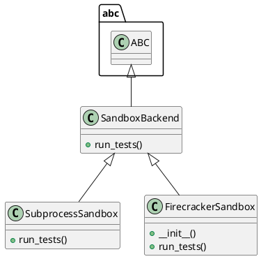

# Document: src/autogen_team/application/mcp/tools/run_tests.py

## Module Overview

Run Tests tool — runs pytest in an isolated sandbox.

### Purpose
Provides functionality for `run_tests`.

### Responsibilities
Handles operations and definitions related to `run_tests`.

### Main Workflow
Execution flow defined by the functions and classes in the module.

### Dependencies
- `__future__.annotations`
- `abc`
- `os`
- `shutil`
- `subprocess`
- `sys`
- `tempfile`
- `typing`
- `loguru.logger`
- `autogen_team.core.security.safe_join`

## Public API

### Exported Classes
- `SandboxBackend`
- `SubprocessSandbox`
- `FirecrackerSandbox`

### Exported Functions
- `run_tests`

## Class `SandboxBackend`

### Overview

Abstract sandbox backend for running tests.

Provides an interface for future Firecracker MicroVM integration.

### Public Method `run_tests`

#### Description
Run tests in the sandbox.

Args:
    workspace_dir: Path to the workspace with changes applied.
    timeout: Maximum execution time in seconds.

Returns:
    Dict with passed, summary, and details fields.

#### Inputs
- `workspace_dir` (str): semantic meaning. Required.
- `timeout` (int): semantic meaning. Optional (default: `300`).

#### Output
- Return type: `T.Dict[(str, T.Any)]`
- Semantic meaning: Result of the operation.

#### Side Effects
May update internal state or external services.

#### Complexity
- Time Complexity: O(1) mostly.
- Space Complexity: O(1) mostly.

#### Example
```python
# Example usage of run_tests
instance.run_tests()
```

## Class `SubprocessSandbox`

### Overview

Subprocess-based sandbox for running pytest.

### Public Method `run_tests`

#### Description
Run pytest via subprocess in the given workspace.

Args:
    workspace_dir: Path to the workspace with changes applied.
    timeout: Maximum execution time in seconds.

Returns:
    Dict with passed, summary, and details fields.

#### Inputs
- `workspace_dir` (str): semantic meaning. Required.
- `timeout` (int): semantic meaning. Optional (default: `300`).

#### Output
- Return type: `T.Dict[(str, T.Any)]`
- Semantic meaning: Result of the operation.

#### Side Effects
May update internal state or external services.

#### Complexity
- Time Complexity: O(1) mostly.
- Space Complexity: O(1) mostly.

#### Example
```python
# Example usage of run_tests
instance.run_tests()
```

## Class `FirecrackerSandbox`

### Overview

Firecracker-based sandbox using SandboxService.

### Constructor

No description provided.

**Parameters:**
- `sandbox_service` (T.Any | None) = `None`

### Public Method `run_tests`

#### Description
Note: This is a synchronous wrapper for the async service.
In a real scenario, the tool should be async.

#### Inputs
- `workspace_dir` (str): semantic meaning. Required.
- `timeout` (int): semantic meaning. Optional (default: `300`).

#### Output
- Return type: `T.Dict[(str, T.Any)]`
- Semantic meaning: Result of the operation.

#### Side Effects
May update internal state or external services.

#### Complexity
- Time Complexity: O(1) mostly.
- Space Complexity: O(1) mostly.

#### Example
```python
# Example usage of run_tests
instance.run_tests()
```

## Public Function `run_tests`

### Description
Run pytest against code changes in an isolated sandbox.

Args:
    changes: Dict with files_changed list (path, action, content).
    workspace_path: Original workspace path to copy from.
    timeout: Max execution time in seconds.
    sandbox: Optional sandbox backend (defaults to SubprocessSandbox).

Returns:
    Dict with passed bool, summary string, and details.

### Inputs
- `changes` (T.Dict[(str, T.Any)]): semantic meaning. Required.
- `workspace_path` (str): semantic meaning. Optional (default: `''`).
- `timeout` (int): semantic meaning. Optional (default: `300`).
- `sandbox` (SandboxBackend | None): semantic meaning. Optional (default: `None`).

### Output
- Return type: `T.Dict[(str, T.Any)]`
- Semantic meaning: Result of the operation.

### Side Effects
May update state or affect global resources.

### Complexity
- Time Complexity: O(1) mostly.
- Space Complexity: O(1) mostly.

### Example
```python
# Example usage of run_tests
run_tests()
```

## UML Diagram



