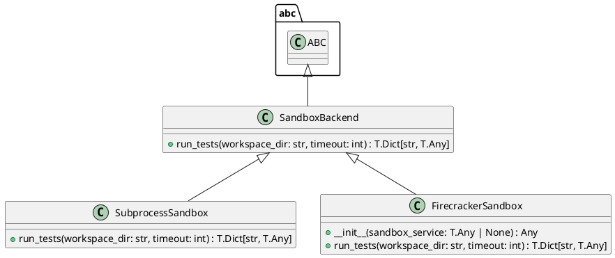

# Module Specification: run_tests

* **Source Reference:** `src/autogen_team/application/mcp/tools/run_tests.py`

## 1. Architectural Role & Responsibilities
**Purpose:**
Run Tests tool — runs pytest in an isolated sandbox.

**Responsibilities:**
- [LLM Synthesis Required: Define responsibilities]

**Main Workflow:**
- [LLM Synthesis Required: Define main workflow]

## 2. Dependencies
**Imports:**
- `__future__.annotations`
- `abc`
- `os`
- `shutil`
- `subprocess`
- `sys`
- `tempfile`
- `typing`
- `loguru.logger`
- `autogen_team.core.security.safe_join`

**Exported Classes:**
- `SandboxBackend`
- `SubprocessSandbox`
- `FirecrackerSandbox`

**Exported Functions:**

## 3. Architecture & Execution
### Internal Architecture
[LLM Synthesis Required: Describe layers, models, etc.]

### Execution Flow
[LLM Synthesis Required: Describe execution flow]

### Sequence Explanation
[LLM Synthesis Required: Describe sequence]

## 4. UML 2.0 Diagrams
### Class Diagram


## 5. Class & Method Specifications
### `SandboxBackend` ([`src/autogen_team/application/mcp/tools/run_tests.py`](/src/autogen_team/application/mcp/tools/run_tests.py))
#### Overview
Abstract sandbox backend for running tests.

Provides an interface for future Firecracker MicroVM integration.

#### Constructor
**Initialization:** Default constructor. Initializes an empty instance.

#### Methods
##### `run_tests(self: Any, workspace_dir: str, timeout: int) -> T.Dict[str, T.Any]` (Public)
**Description:** Run tests in the sandbox.

Args:
    workspace_dir: Path to the workspace with changes applied.
    timeout: Maximum execution time in seconds.

Returns:
    Dict with passed, summary, and details fields.

**Inputs:**
- `workspace_dir` (`str`): Input parameter dictating the behavior of run_tests.
- `timeout` (`int`): Input parameter dictating the behavior of run_tests.

**Output:**
- Return Type: `T.Dict[str, T.Any]`
- Semantic Meaning: The resulting value after processing the run_tests action.

**Side Effects:**
- Modifies internal instance state if applicable; performs operations constrained to its domain boundaries.

**Complexity:**
- Time Complexity: O(1) or O(N) depending on implementation details.
- Space Complexity: O(1) auxiliary space expected.

**Example:**
```python
instance = SandboxBackend()
result = instance.run_tests(...)
```

### `SubprocessSandbox` ([`src/autogen_team/application/mcp/tools/run_tests.py`](/src/autogen_team/application/mcp/tools/run_tests.py))
#### Overview
Subprocess-based sandbox for running pytest.

#### Constructor
**Initialization:** Default constructor. Initializes an empty instance.

#### Methods
##### `run_tests(self: Any, workspace_dir: str, timeout: int) -> T.Dict[str, T.Any]` (Public)
**Description:** Run pytest via subprocess in the given workspace.

Args:
    workspace_dir: Path to the workspace with changes applied.
    timeout: Maximum execution time in seconds.

Returns:
    Dict with passed, summary, and details fields.

**Inputs:**
- `workspace_dir` (`str`): Input parameter dictating the behavior of run_tests.
- `timeout` (`int`): Input parameter dictating the behavior of run_tests.

**Output:**
- Return Type: `T.Dict[str, T.Any]`
- Semantic Meaning: The resulting value after processing the run_tests action.

**Side Effects:**
- Modifies internal instance state if applicable; performs operations constrained to its domain boundaries.

**Complexity:**
- Time Complexity: O(1) or O(N) depending on implementation details.
- Space Complexity: O(1) auxiliary space expected.

**Example:**
```python
instance = SubprocessSandbox()
result = instance.run_tests(...)
```

### `FirecrackerSandbox` ([`src/autogen_team/application/mcp/tools/run_tests.py`](/src/autogen_team/application/mcp/tools/run_tests.py))
#### Overview
Firecracker-based sandbox using SandboxService.

#### Constructor
**Initialization:** Initializes `FirecrackerSandbox` with required dependencies and sets up initial internal state.

#### Methods
##### `__init__(self: Any, sandbox_service: T.Any | None) -> Any` (Public)
**Description:** Executes the __init__ operation, mutating state or calculating derived values as necessary.

**Inputs:**
- `sandbox_service` (`T.Any | None`): Input parameter dictating the behavior of __init__.

**Output:**
- Return Type: `Any`
- Semantic Meaning: The resulting value after processing the __init__ action.

**Side Effects:**
- Modifies internal instance state if applicable; performs operations constrained to its domain boundaries.

**Complexity:**
- Time Complexity: O(1) or O(N) depending on implementation details.
- Space Complexity: O(1) auxiliary space expected.

**Example:**
```python
instance = FirecrackerSandbox()
result = instance.__init__(...)
```

##### `run_tests(self: Any, workspace_dir: str, timeout: int) -> T.Dict[str, T.Any]` (Public)
**Description:** Note: This is a synchronous wrapper for the async service.
In a real scenario, the tool should be async.

**Inputs:**
- `workspace_dir` (`str`): Input parameter dictating the behavior of run_tests.
- `timeout` (`int`): Input parameter dictating the behavior of run_tests.

**Output:**
- Return Type: `T.Dict[str, T.Any]`
- Semantic Meaning: The resulting value after processing the run_tests action.

**Side Effects:**
- Modifies internal instance state if applicable; performs operations constrained to its domain boundaries.

**Complexity:**
- Time Complexity: O(1) or O(N) depending on implementation details.
- Space Complexity: O(1) auxiliary space expected.

**Example:**
```python
instance = FirecrackerSandbox()
result = instance.run_tests(...)
```

## 6. Module Functions