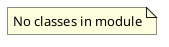

# Document: src/autogen_team/application/mcp/tools/security_review.py

## Module Overview

Security Review tool — analyzes code diffs against OWASP patterns and R2R RAG.

### Purpose
Provides functionality for `security_review`.

### Responsibilities
Handles operations and definitions related to `security_review`.

### Main Workflow
Execution flow defined by the functions and classes in the module.

### Dependencies
- `__future__.annotations`
- `json`
- `re`
- `typing`
- `loguru.logger`
- `httpx`
- `litellm`
- `autogen_team.infrastructure.services.mcp_service.MCPService`

## Public API

### Exported Classes
None

### Exported Functions
- `security_review`

## Private Function `_scan_owasp_patterns`

**Purpose:** Scan diff against OWASP patterns.

Args:
    diff: The code diff string to analyze.

Returns:
    List of findings dicts with rule, severity, location, description.

**Parameters:**
- `diff`: str

**Return value:**
- `T.List[T.Dict[(str, str)]]`

## Private Function `_query_r2r_security`

**Purpose:** Query R2R RAG for security best practices relevant to the diff.

Args:
    diff: Code diff to find context for.
    r2r_base_url: R2R API base URL.

Returns:
    List of relevant security documents.

**Parameters:**
- `diff`: str
- `r2r_base_url`: str

**Return value:**
- `T.List[T.Dict[(str, T.Any)]]`

## Public Function `security_review`

### Description
Analyze code diffs against OWASP patterns and R2R RAG security knowledge.

Args:
    diff: The code diff string to review.

Returns:
    Dict with status (approved/rejected) and findings list.

### Inputs
- `diff` (str): semantic meaning. Required.

### Output
- Return type: `T.Dict[(str, T.Any)]`
- Semantic meaning: Result of the operation.

### Side Effects
May update state or affect global resources.

### Complexity
- Time Complexity: O(1) mostly.
- Space Complexity: O(1) mostly.

### Example
```python
# Example usage of security_review
security_review()
```

## UML Diagram


