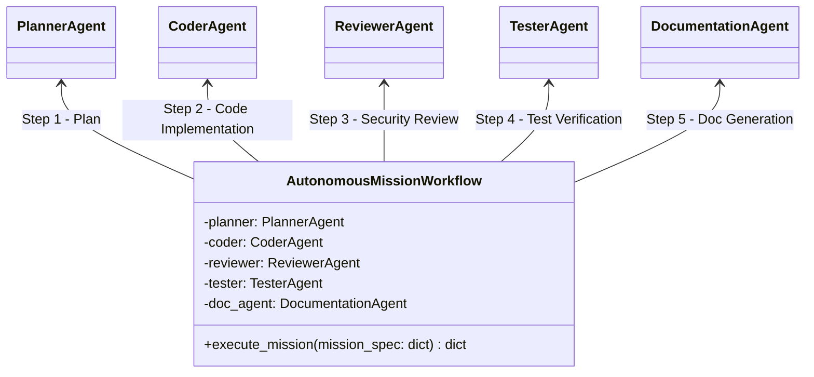
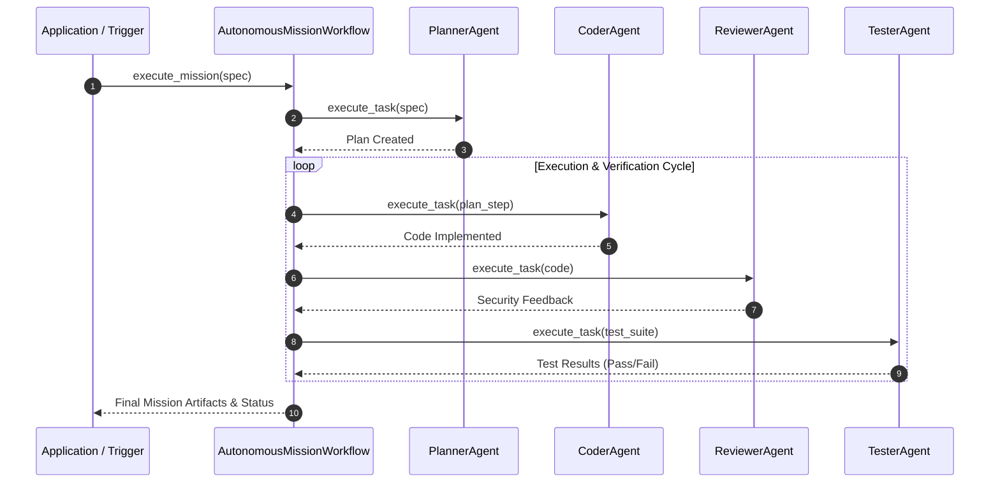

# Module Name: application/workflows

* **Source Directory Reference:** `src/autogen_team/application/workflows/`
* **Package Dependency:** Upstream: `src/autogen_team/application/agents/`. Downstream: CLI scripts, Hatchet workflows (`src/autogen_team/infrastructure/orchestration/`).

## 1. Executive Summary & Purpose

The `application/workflows` module orchestrates multi-agent interaction loops for complex software engineering missions (`autonomous_mission.py`). It coordinates execution state transitions between `PlannerAgent`, `CoderAgent`, `ReviewerAgent`, `TesterAgent`, and `DocumentationAgent`.

## 2. UML 2.0 Class & Execution Architecture

## 3. Package & Class Relations

* **Workflow Orchestration:** `AutonomousMissionWorkflow` handles sequential and iterative feedback loops. If `ReviewerAgent` or `TesterAgent` reports failures, the mission returns control back to `CoderAgent` for automated patch generation.

## 4. Execution Flow & Runtime Behavior

---

* **Source Citations:**
  * Autonomous Mission Workflow: `src/autogen_team/application/workflows/autonomous_mission.py:1-35`
