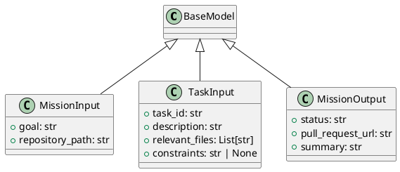

# Module Specification: autonomous_mission

* **Source Reference:** `src/autogen_team/application/workflows/autonomous_mission.py`

## 1. Architectural Role & Responsibilities
**Purpose:**
Hatchet Workflow DSL for Autonomous Missions.

Orchestrates the autonomous mission lifecycle:
    Plan → Fan-Out (parallel coding) → Aggregate & Review

Uses the Hatchet V1 SDK with ``aio_run_many`` for true parallel
child-workflow fan-out instead of sequential task execution.

**Responsibilities:**
- [LLM Synthesis Required: Define responsibilities]

**Main Workflow:**
- [LLM Synthesis Required: Define main workflow]

## 2. Dependencies
**Imports:**
- `typing.Any`
- `typing.Dict`
- `typing.List`
- `autogen_team.application.agents.coder_agent.CoderAgent`
- `autogen_team.application.agents.documentation_agent.DocumentationAgent`
- `autogen_team.application.agents.planner_agent.PlannerAgent`
- `autogen_team.application.agents.reviewer_agent.ReviewerAgent`
- `autogen_team.application.agents.tester_agent.TesterAgent`
- `autogen_team.infrastructure.services.hatchet_service.HatchetService`
- `hatchet_sdk.Context`
- `pydantic.BaseModel`

**Exported Classes:**
- `MissionInput`
- `TaskInput`
- `MissionOutput`

**Exported Functions:**

## 3. Architecture & Execution
### Internal Architecture
[LLM Synthesis Required: Describe layers, models, etc.]

### Execution Flow
[LLM Synthesis Required: Describe execution flow]

### Sequence Explanation
[LLM Synthesis Required: Describe sequence]

## 4. UML 2.0 Diagrams
### Class Diagram

## 5. Class & Method Specifications
### `MissionInput` ([`src/autogen_team/application/workflows/autonomous_mission.py`](/src/autogen_team/application/workflows/autonomous_mission.py))
#### Overview
Input for the top-level autonomous-mission workflow.

#### Constructor
**Initialization:** Default constructor. Initializes an empty instance.

#### Attributes
- `goal` (`str`): Maintains the state for goal.
- `repository_path` (`str`): Maintains the state for repository_path.

#### Methods
### `TaskInput` ([`src/autogen_team/application/workflows/autonomous_mission.py`](/src/autogen_team/application/workflows/autonomous_mission.py))
#### Overview
Input for a single child coding-task workflow.

#### Constructor
**Initialization:** Default constructor. Initializes an empty instance.

#### Attributes
- `task_id` (`str`): Maintains the state for task_id.
- `description` (`str`): Maintains the state for description.
- `relevant_files` (`List[str]`): Maintains the state for relevant_files.
- `constraints` (`str | None`): Maintains the state for constraints.

#### Methods
### `MissionOutput` ([`src/autogen_team/application/workflows/autonomous_mission.py`](/src/autogen_team/application/workflows/autonomous_mission.py))
#### Overview
Final output of the autonomous-mission workflow.

#### Constructor
**Initialization:** Default constructor. Initializes an empty instance.

#### Attributes
- `status` (`str`): Maintains the state for status.
- `pull_request_url` (`str`): Maintains the state for pull_request_url.
- `summary` (`str`): Maintains the state for summary.

#### Methods
## 6. Module Functions