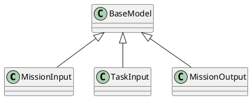

# Document: src/autogen_team/application/workflows/autonomous_mission.py

## Module Overview

Hatchet Workflow DSL for Autonomous Missions.

Orchestrates the autonomous mission lifecycle:
    Plan → Fan-Out (parallel coding) → Aggregate & Review

Uses the Hatchet V1 SDK with ``aio_run_many`` for true parallel
child-workflow fan-out instead of sequential task execution.

### Purpose
Provides functionality for `autonomous_mission`.

### Responsibilities
Handles operations and definitions related to `autonomous_mission`.

### Main Workflow
Execution flow defined by the functions and classes in the module.

### Dependencies
- `typing.Any`
- `typing.Dict`
- `typing.List`
- `autogen_team.application.agents.coder_agent.CoderAgent`
- `autogen_team.application.agents.documentation_agent.DocumentationAgent`
- `autogen_team.application.agents.planner_agent.PlannerAgent`
- `autogen_team.application.agents.reviewer_agent.ReviewerAgent`
- `autogen_team.application.agents.tester_agent.TesterAgent`
- `autogen_team.infrastructure.services.hatchet_service.HatchetService`
- `hatchet_sdk.Context`
- `pydantic.BaseModel`

## Public API

### Exported Classes
- `MissionInput`
- `TaskInput`
- `MissionOutput`

### Exported Functions
- `execute_coding_task`
- `plan`
- `fan_out_tasks`
- `aggregate_and_review`
- `document_mission`

## Class `MissionInput`

### Overview

Input for the top-level autonomous-mission workflow.

### Attributes

- `goal` (str): Public property.
- `repository_path` (str): Public property.

## Class `TaskInput`

### Overview

Input for a single child coding-task workflow.

### Attributes

- `task_id` (str): Public property.
- `description` (str): Public property.
- `relevant_files` (List[str]): Public property.
- `constraints` (str | None): Public property.

## Class `MissionOutput`

### Overview

Final output of the autonomous-mission workflow.

### Attributes

- `status` (str): Public property.
- `pull_request_url` (str): Public property.
- `summary` (str): Public property.

## Public Function `execute_coding_task`

### Description
Run the Coder Agent on a single task inside a child workflow.

### Inputs
- `task_input` (TaskInput): semantic meaning. Required.
- `context` (Context): semantic meaning. Required.

### Output
- Return type: `Dict[(str, Any)]`
- Semantic meaning: Result of the operation.

### Side Effects
May update state or affect global resources.

### Complexity
- Time Complexity: O(1) mostly.
- Space Complexity: O(1) mostly.

### Example
```python
# Example usage of execute_coding_task
execute_coding_task()
```

## Public Function `plan`

### Description
Step 1: Planner Agent analyses the goal and creates a task DAG.

### Inputs
- `mission_input` (MissionInput): semantic meaning. Required.
- `context` (Context): semantic meaning. Required.

### Output
- Return type: `Dict[(str, Any)]`
- Semantic meaning: Result of the operation.

### Side Effects
May update state or affect global resources.

### Complexity
- Time Complexity: O(1) mostly.
- Space Complexity: O(1) mostly.

### Example
```python
# Example usage of plan
plan()
```

## Public Function `fan_out_tasks`

### Description
Step 2: Spawn parallel child workflows for each coding task.

Uses ``develop_task_workflow.aio_run_many`` for true parallel
fan-out execution across the Hatchet worker pool.

### Inputs
- `mission_input` (MissionInput): semantic meaning. Required.
- `context` (Context): semantic meaning. Required.

### Output
- Return type: `Dict[(str, Any)]`
- Semantic meaning: Result of the operation.

### Side Effects
May update state or affect global resources.

### Complexity
- Time Complexity: O(1) mostly.
- Space Complexity: O(1) mostly.

### Example
```python
# Example usage of fan_out_tasks
fan_out_tasks()
```

## Public Function `aggregate_and_review`

### Description
Step 3: Aggregate child results, run tests, and perform security review.

### Inputs
- `mission_input` (MissionInput): semantic meaning. Required.
- `context` (Context): semantic meaning. Required.

### Output
- Return type: `MissionOutput`
- Semantic meaning: Result of the operation.

### Side Effects
May update state or affect global resources.

### Complexity
- Time Complexity: O(1) mostly.
- Space Complexity: O(1) mostly.

### Example
```python
# Example usage of aggregate_and_review
aggregate_and_review()
```

## Public Function `document_mission`

### Description
Step 4: Generate documentation and diagrams for the mission.

### Inputs
- `mission_input` (MissionInput): semantic meaning. Required.
- `context` (Context): semantic meaning. Required.

### Output
- Return type: `MissionOutput`
- Semantic meaning: Result of the operation.

### Side Effects
May update state or affect global resources.

### Complexity
- Time Complexity: O(1) mostly.
- Space Complexity: O(1) mostly.

### Example
```python
# Example usage of document_mission
document_mission()
```

## UML Diagram



