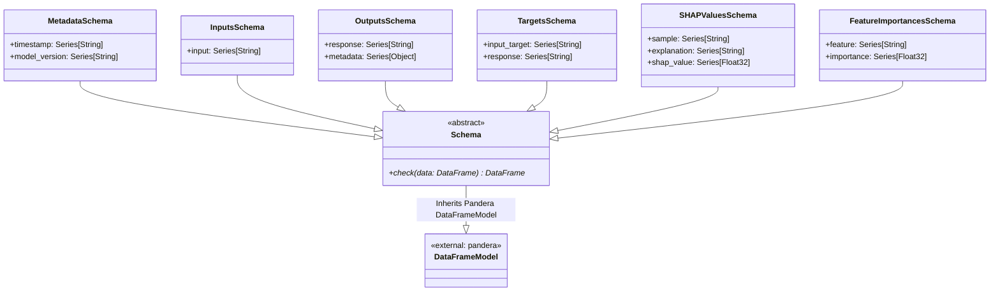
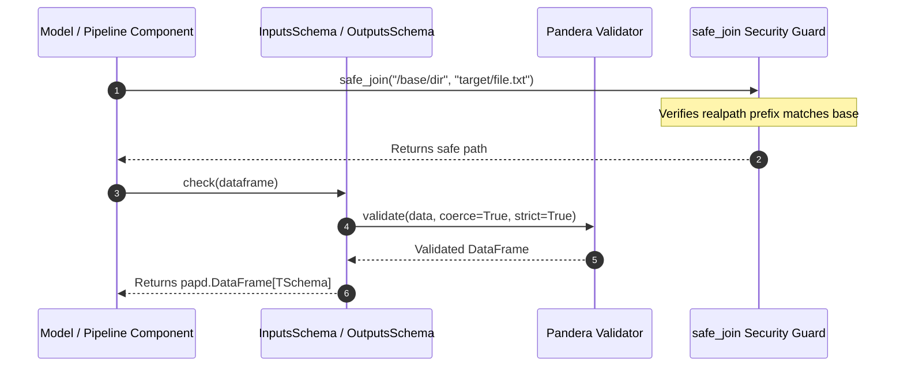

# Module Name: core

* **Source Directory Reference:** `src/autogen_team/core/`
* **Package Dependency:** Upstream: `pandera`, `pandas`, `pydantic`. Downstream: `src/autogen_team/models/`, `src/autogen_team/application/`, `src/autogen_team/data_access/`.

## 1. Executive Summary & Purpose

The `core` module establishes the strict type contracts, schema definitions, and file-system security utilities for the entire repository. It uses `pandera.DataFrameModel` to enforce runtime validation on inputs, targets, predictions, SHAP values, metadata, and feature importances. Additionally, it provides path-traversal prevention via `safe_join()`.

## 2. UML 2.0 Class & Inheritance Architecture (Deterministic)

The following class diagram derived from local AST analysis models the Pandera dataframe schema inheritance tree:

## 3. Package & Class Relations

* **Inheritance & Validation:** `Schema` inherits from `pandera.DataFrameModel`. All data schemas (`InputsSchema`, `OutputsSchema`, `TargetsSchema`, `SHAPValuesSchema`, `FeatureImportancesSchema`, `MetadataSchema`) specialize `Schema` with strict column definitions and coercions.
* **Security Layer:** `src/autogen_team/core/security.py` defines `safe_join(base: str, *paths: str) -> str`, which guards against directory traversal attacks by validating path commonalities.

## 4. Execution Flow & Runtime Behavior

---

* **Source Citations:**
  * Base Schema Class: `src/autogen_team/core/schemas.py:18-47`
  * Data Schemas (`InputsSchema`, `OutputsSchema`, etc.): `src/autogen_team/core/schemas.py:49-98`
  * Security `safe_join`: `src/autogen_team/core/security.py:6-26`
