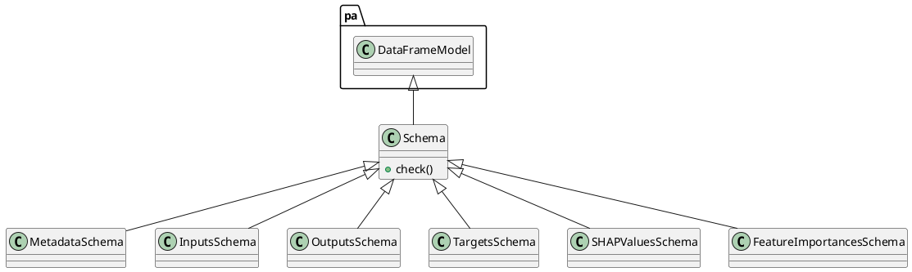

# Document: src/autogen_team/core/schemas.py

## Module Overview

### Purpose
Provides functionality for `schemas`.

### Responsibilities
Handles operations and definitions related to `schemas`.

### Main Workflow
Execution flow defined by the functions and classes in the module.

### Dependencies
- `typing`
- `pandas`
- `pandera`
- `pandera.typing`
- `pandera.typing.common`

## Public API

### Exported Classes
- `Schema`
- `MetadataSchema`
- `InputsSchema`
- `OutputsSchema`
- `TargetsSchema`
- `SHAPValuesSchema`
- `FeatureImportancesSchema`

### Exported Functions
None

## Class `Schema`

### Overview

Base class for a dataframe schema.

Use a schema to type your dataframe object.
e.g., to communicate and validate its fields.

### Public Method `check`

#### Description
Check the dataframe with this schema.

Args:
    data (pd.DataFrame): dataframe to check.

Returns:
    papd.DataFrame[TSchema]: validated dataframe.

#### Inputs
- `data` (pd.DataFrame): semantic meaning. Required.

#### Output
- Return type: `papd.DataFrame[TSchema]`
- Semantic meaning: Result of the operation.

#### Side Effects
May update internal state or external services.

#### Complexity
- Time Complexity: O(1) mostly.
- Space Complexity: O(1) mostly.

#### Example
```python
# Example usage of check
instance.check()
```

## Class `MetadataSchema`

### Overview

Schema for metadata in outputs.

### Attributes

- `timestamp` (papd.Series[padt.String]): Public property.
- `model_version` (papd.Series[padt.String]): Public property.

## Class `InputsSchema`

### Overview

Schema for validating large string inputs.

### Attributes

- `input` (papd.Series[padt.String]): Public property.

## Class `OutputsSchema`

### Overview

Schema for structured JSON outputs.

### Attributes

- `response` (papd.Series[padt.String]): Public property.
- `metadata` (papd.Series[padt.Object]): Public property.

## Class `TargetsSchema`

### Overview

Schema for the project target.

### Attributes

- `input_target` (papd.Series[padt.String]): Public property.
- `response` (papd.Series[padt.String]): Public property.

## Class `SHAPValuesSchema`

### Overview

Schema for SHAP values.

### Attributes

- `sample` (papd.Series[padt.String]): Public property.
- `explanation` (papd.Series[padt.String]): Public property.
- `shap_value` (papd.Series[padt.Float32]): Public property.

## Class `FeatureImportancesSchema`

### Overview

Schema for feature importances.

### Attributes

- `feature` (papd.Series[padt.String]): Public property.
- `importance` (papd.Series[padt.Float32]): Public property.

## UML Diagram



