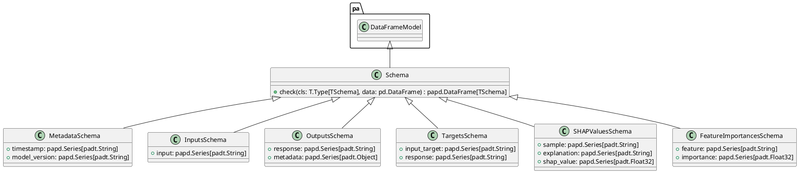

# Module Specification: schemas

* **Source Reference:** `src/autogen_team/core/schemas.py`

## 1. Architectural Role & Responsibilities
**Purpose:**
[No description available. LLM synthesis required.]

**Responsibilities:**
- [LLM Synthesis Required: Define responsibilities]

**Main Workflow:**
- [LLM Synthesis Required: Define main workflow]

## 2. Dependencies
**Imports:**
- `typing`
- `pandas`
- `pandera`
- `pandera.typing`
- `pandera.typing.common`

**Exported Classes:**
- `Schema`
- `MetadataSchema`
- `InputsSchema`
- `OutputsSchema`
- `TargetsSchema`
- `SHAPValuesSchema`
- `FeatureImportancesSchema`

**Exported Functions:**

## 3. Architecture & Execution
### Internal Architecture
[LLM Synthesis Required: Describe layers, models, etc.]

### Execution Flow
[LLM Synthesis Required: Describe execution flow]

### Sequence Explanation
[LLM Synthesis Required: Describe sequence]

## 4. UML 2.0 Diagrams
### Class Diagram


## 5. Class & Method Specifications
### `Schema` ([`src/autogen_team/core/schemas.py`](/src/autogen_team/core/schemas.py))
#### Overview
Base class for a dataframe schema.

Use a schema to type your dataframe object.
e.g., to communicate and validate its fields.

#### Constructor
**Initialization:** Default constructor. Initializes an empty instance.

#### Methods
##### `check(cls: T.Type[TSchema], data: pd.DataFrame) -> papd.DataFrame[TSchema]` (Public)
**Description:** Check the dataframe with this schema.

Args:
    data (pd.DataFrame): dataframe to check.

Returns:
    papd.DataFrame[TSchema]: validated dataframe.

**Inputs:**
- `cls` (`T.Type[TSchema]`): Input parameter dictating the behavior of check.
- `data` (`pd.DataFrame`): Input parameter dictating the behavior of check.

**Output:**
- Return Type: `papd.DataFrame[TSchema]`
- Semantic Meaning: The resulting value after processing the check action.

**Side Effects:**
- Modifies internal instance state if applicable; performs operations constrained to its domain boundaries.

**Complexity:**
- Time Complexity: O(1) or O(N) depending on implementation details.
- Space Complexity: O(1) auxiliary space expected.

**Example:**
```python
instance = Schema()
result = instance.check(...)
```

### `MetadataSchema` ([`src/autogen_team/core/schemas.py`](/src/autogen_team/core/schemas.py))
#### Overview
Schema for metadata in outputs.

#### Constructor
**Initialization:** Default constructor. Initializes an empty instance.

#### Attributes
- `timestamp` (`papd.Series[padt.String]`): Maintains the state for timestamp.
- `model_version` (`papd.Series[padt.String]`): Maintains the state for model_version.

#### Methods
### `InputsSchema` ([`src/autogen_team/core/schemas.py`](/src/autogen_team/core/schemas.py))
#### Overview
Schema for validating large string inputs.

#### Constructor
**Initialization:** Default constructor. Initializes an empty instance.

#### Attributes
- `input` (`papd.Series[padt.String]`): Maintains the state for input.

#### Methods
### `OutputsSchema` ([`src/autogen_team/core/schemas.py`](/src/autogen_team/core/schemas.py))
#### Overview
Schema for structured JSON outputs.

#### Constructor
**Initialization:** Default constructor. Initializes an empty instance.

#### Attributes
- `response` (`papd.Series[padt.String]`): Maintains the state for response.
- `metadata` (`papd.Series[padt.Object]`): Maintains the state for metadata.

#### Methods
### `TargetsSchema` ([`src/autogen_team/core/schemas.py`](/src/autogen_team/core/schemas.py))
#### Overview
Schema for the project target.

#### Constructor
**Initialization:** Default constructor. Initializes an empty instance.

#### Attributes
- `input_target` (`papd.Series[padt.String]`): Maintains the state for input_target.
- `response` (`papd.Series[padt.String]`): Maintains the state for response.

#### Methods
### `SHAPValuesSchema` ([`src/autogen_team/core/schemas.py`](/src/autogen_team/core/schemas.py))
#### Overview
Schema for SHAP values.

#### Constructor
**Initialization:** Default constructor. Initializes an empty instance.

#### Attributes
- `sample` (`papd.Series[padt.String]`): Maintains the state for sample.
- `explanation` (`papd.Series[padt.String]`): Maintains the state for explanation.
- `shap_value` (`papd.Series[padt.Float32]`): Maintains the state for shap_value.

#### Methods
### `FeatureImportancesSchema` ([`src/autogen_team/core/schemas.py`](/src/autogen_team/core/schemas.py))
#### Overview
Schema for feature importances.

#### Constructor
**Initialization:** Default constructor. Initializes an empty instance.

#### Attributes
- `feature` (`papd.Series[padt.String]`): Maintains the state for feature.
- `importance` (`papd.Series[padt.Float32]`): Maintains the state for importance.

#### Methods
## 6. Module Functions